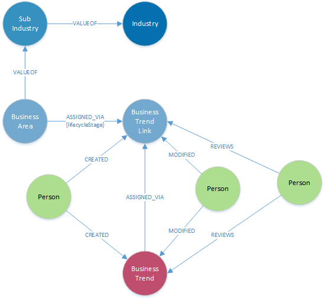

### **Node Definitions**

#### Node Label: BusinessTrend

|Property|Description|
|----|----|
|id|system generated
|Name |short name of the trend
|Description | extended description of the trend
|Source | free text to identify the source of trend 
|Reference | option URI link to the source material

#### Node Label: BusinessTrendLink

|Property|Description|
|----|----|
|id|system generated
|Description | industry use case description for a single trend

#### Node Label: Industry

|Property|Description|
|----|----|
|id|system generated
|Name|top level industry - aligned with DXC taxonomy
|Description | extended description for the industry

#### Node Label: SubIndustry

|Property|Description|
|----|----|
|id|system generated
|Name|industry segment - aligned with DXC taxonomy
|Description | extended description for the sub-industry 

 #### Node Label: BusinessArea

|Property|Description|
|----|----|
|id|system generated
|Name| short text for the name of the business area
|Description | extended description of the business area

## Reused system nodes

#### Node Label: Person

Auto generated when user logs in

|Property|Description|
|----|----|
|id|system generated
|Name|as defined in Global Pass
|email|as defined in Global Pass

### Relationships

|Source|Destination|Name|Properties|
|----|----|----|----|
|BusinessTrend|BusinessTrendLink|ASSIGNED_VIA|
|BusinessArea|BusinessTrendLink|ASSIGNED_VIA|lifecycleStage
|BusinessArea|SubIndustry|VALUEOF
|SubIndustry|Industry|VALUEOF
|Person|BusinessTrend|CREATED
|Person|BusinessTrendLink|CREATED
|Person|BusinessTrend|REVIEWS
|Person|BusinessTrendLink|REVIEWS
|Person|BusinessTrend|MODIFIED
|Person|BusinessTrendLink|MODIFIED