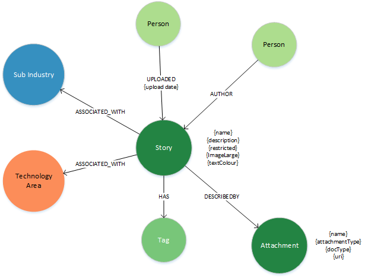

### **Node Definitions**

#### Node Label: Story

|Property|Description|
|----|----|
|id|system generated
|name | short title for the story
|description | extended description for the story
|restricted | boolean - identifies if the content is restricted to DXC employees only
|imagelarge | URI to the story banner
|textColour| boolean white or black text

#### Node Label: Person

Auto generated when user logs in

|Property|Description|
|----|----|
|id|system generated
|Name|as defined in Global Pass
|email|as defined in Global Pass

#### Relationships

|Source|Destination|Name|Properties|
|----|----|----|----|
|Person|Story|AUTHOR
|Person|Story|UPLOADED
|Story|Sub Industry|ASSOICATED_WITH
|Story|TechnologyGroup|ASSOICATED_WITH
|Story|Tag|HAS
|Story|Attachment|DESCRIBED_BY

