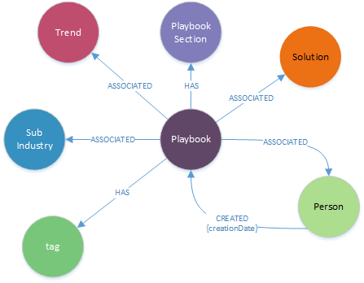

### **Node Definitions**

#### Node Label: Playbook

|Property|Description|type|limits
|----|----|----|----|
|id|system generated
|name |name of the solution|string string 240 Characters
|Subtitle| |string string 240 Characters
|Text| |string 5000 Characters
|TitleImage|URI address for the image

#### Node Label: PlaybookSection

|Property|Description|type|limits
|----|----|----|----|
|id|system generated
|SectionText1| |string 5000 Characters
|SectionText2| |string 5000 Characters
|SectionImage|URI address for the image

#### Relationships

|Source|Destination|Name|Properties|
|----|----|----|----|
|Playbook|PlaybookSection|HAS
|Playbook|BusinessTrend|ASSOCIATED
|Playbook|TechnologyTrend|ASSOCIATED
|Playbook|Solution|ASSOCIATED
|Playbook|SubIndustry|ASSOCIATED
|Playbook|Tag|HAS
|Playbook|Person|ASSOCIATED
|Playbook|Person|CREATED {creationDate}
