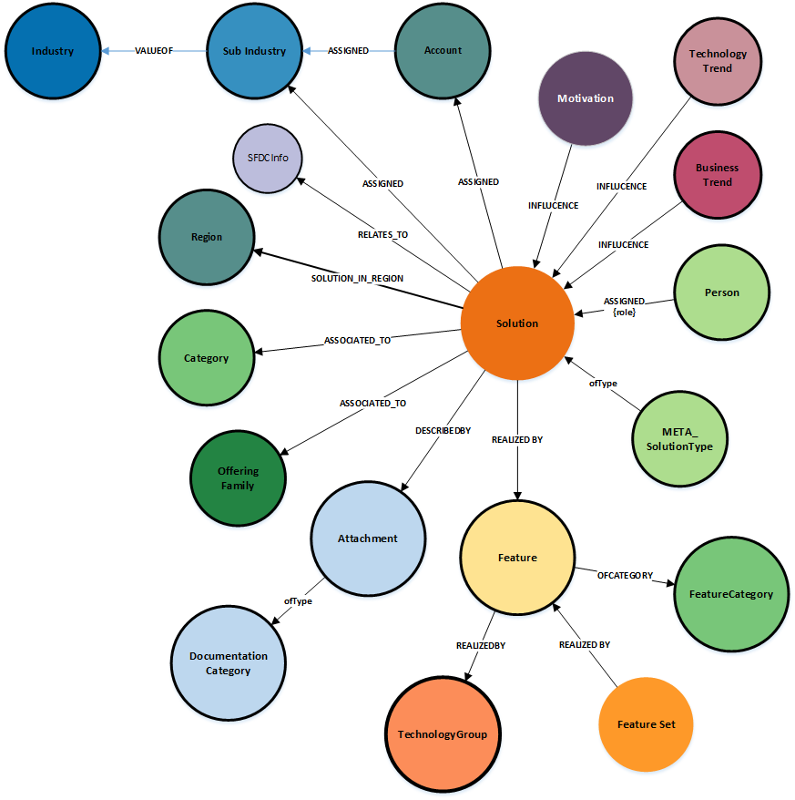

Note : Any nodes with a solid border are a connection point across the graph model 

### **Node Definitions**

#### Node Label: Solution
Scope : Top level object for solutions
Architecture Layer : Business
Ratio : 1

|Property|Description|type|limits
|----|----|----|----|
|id|system generated
|objectClass|system generated value = `Archimate_Product`|string
|name |name of the solution|string
|description |extended description of the solution|string
|elevatorPitch |short description of the solution |string|140 characters
|generalValue |value proposition |string
|creationDate |system generated creation date|longdate
|Status|Status of the solution|string
|lastModificationDate |system generated last modified date|longdate
|referenceable|value to set if solution is externally referencable|string |default = no
|searchable|boolean value to set if the solution is returned in the search results|boolean| default = `true`
|solution.BusinessValue|Quantitate value of the solution in terms of business outcomes|string
|solution.TechnicalValue|Quantitate value of the solution in terms of technical outcomes|string
|solution.Savings|total savings of the solution in K$|number
|Solution.ImplementationTime|total implementation time for the solution|number
|solution.TCV|total contract value of the solution|number
|solution.FTE|total number of resources who delivered the solution (end-2-end)|number

#### Node Label: SFDCInfo
Scope : Captures key information related to the SFDC opportunity
Architecture Layer : Business
Ratio : n:n

|Property|Description|type|limits
|----|----|----|----|
|id|system generated
|OpportunityID|ID of the SFDC opportunity|string

#### Node Label: Motivation
Scope : Key Business drivers and goals
Architecture Layer : Business
Ratio : 1:n

|Property|Description|
|----|----|
|id|system generated
|objectClass|Archimate_Driver
|name |
|description |

#####Node Label: TechnologyTrend

Scope :  Readonly - selected from trend catalog
Architecture Layer : Business
Ratio : 1:n

|Property|Description|
|----|----|
|id|system generated
|name |
|description  

##### Node Label: BusinessTrend
Scope :  Readonly - selected from trend catalog
Architecture Layer : Business
Ratio : 1:n

|Property|Description|
|----|----|
|id|system generated
|name |
|description  

##### Node Label: Feature
Scope :  Component or element within the solution
Architecture Layer : Functional 
Ratio : 1:n

|Property|Description|
|----|----|
|id|system generated
|objectClass|Archimate_Service
|name |
|description  

#### Node Label: FeatureSet
Scope :  Allows grouping of features into logical groups
Architecture Layer : Functional 
Ratio : 1:n

|Property|Description|
|----|----|
|id|system generated
|name |
|description  

#### Node Label: Person
Scope : Queried against Person nodes within database - Readonly
Architecture Layer : Business
Ratio : 1:n

|Property|Description|
|----|----|
|id|system generated
|name|as defined in Global Pass
|email|as defined in Global Pass

#### Node Label: SubIndustry
Scope : identification of target industries (2nd level)
Readonly  - defined within master dictionary 
Architecture Layer : Business
Ratio : 1:n

|Property|Description|
|----|----|
|id|system generated
|name |
|Description  

#### Node Label: Industry
Scope : identification of target industry (top level)
Readonly - defined within master dictionary 
Architecture Layer : Business
Ratio : 1:n

|Property|Description|
|----|----|
|id|system generated
|name |
|description  

#### Node Label: Account
Readonly - defined within master dictionary 
Architecture Layer : Business
Ratio : 1:n

|Property|Description|
|----|----|
|id|system generated
|name |

#### Node Label: solutionType
Scope : high level definition of the type of solution being described (e.g. demo, partner, client, DXC offering)
Readonly - defined within master dictionary 
Ratio : 1:n

|Property|Description|
|----|----|
|id|system generated
|name |

#### Node Label: Category
Scope : Allows a solution to be grouped within a logical set of solutions, outside of the organisation or industry views (e.g. data analytics)  
Readonly - defined within master dictionary 
Ratio : 1:n

|Property|Description|
|----|----|
|id|system generated
|name |

#### Node Label: offeringFamily
Scope : defines the the top level offering families involved within the creation of the solution
Readonly - defined within master dictionary 
Ratio : 1:n

|Property|Description|
|----|----|
|id|system generated
|name |

#### Node Label: technologyGroup
Scope : defines the placement of the feature within the technical view (e.g application, infra)
Readonly - defined within master dictionary 
Ratio : 1:1

|Property|Description|
|----|----|
|id|system generated
|name |
|description  

#### Node Label: FeatureCategory
Scope : defines the type of features (e.g. offering, method, client owned)
Readonly - defined within master dictionary 
Ratio : 1:1

|Property|Description|
|----|----|
|id|system generated
|name |
|description  |

#### Node Label: SolutionType
Scope : defines the type of Solution
Readonly - defined within master dictionary 
Ratio : 1:1

|Property|Description|
|----|----|
|id|system generated
|name |

#### Node Label: Region
Scope : defines the region the solution has been deployed into, or can be deployed into
Readonly - defined within master dictionary 
Ratio : n:n

|Property|Description|
|----|----|
|id|system generated
|name |

#### Node Label: Attachment
Scope : Information related to any attachments associated with the solution
Ratio : 1:n

|Property|Description|
|----|----|
|id|system generated
|name |short name of the attachment
|size| calculated filesize of any uploaded attachment
|attachmentType|LOCAL or REMOTE  identifier 
|docType|file type identifier, eg PDF, video
|uri|location of the attachment 

#### Node Label: DocumentationCategory
Scope : Extended definition node for the type of documentation (e.g `github repo`)
Readonly - defined within master dictionary 
Ratio : 1:1

|Property|Description|
|----|----|
|id|system generated
|name |

### Relationships
|Source|Destination|Name|Properties|
|----|----|----|----|
|Solution|SFDCInfo|RELATES_TO
|Motivation|Solution|INFLUENCE
|TechnologyTrend|Solution|INFLUENCE
|BusinessTrend|Solution|INFLUENCE
|Person|Solution|ASSIGNED|{role}
|Solution|Feature|REALIZED_BY
|FeatureSet|Feature|REALIZED_BY
|Feature|FeatureCategory|OFCATEGORY
|Feature|TechnologyGroup|REALIZEDBY
|Solution|OfferingFamily|ASSOCIATED_TO
|Solution|Category|ASSOCIATED_TO
|Solution|SolutionType|OfType
|Solution|Account|ASSIGNED
|Solution|Category|ASSIGNED
|Solution|Region|SOLUTION_IN_REGION
|Account|SubIndustry|ASSIGNED
|SubIndustry|Industry|VALUEOF
|Solution|Attachment|DESCRIBEDBY
|Attachment|DocumentationCategory|ofType
|Solution|Practice|ASSOCIATED_TO
|Feature|ConfigurationPlan|REALIZED_BY
|Solution|ConfigurationPlan|REALIZED_BY

----

## Change log

| Date | By | Description
|---|---|---|
|Jan 2018| David Stevens | First version
|May 2018| David Stevens | Updates to the attachment model (DocType)
|August 2018| David Stevens | Updates to solution properties for Quantitate values, new SFDC node, relationship to Region
