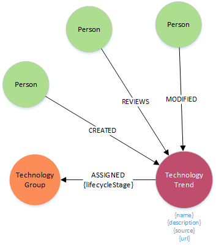

### **Node Definitions**

#### Node Label: TechnologyTrend

|Property|Description|
|----|----|
|id|system generated
|Name |
|Description  
|Source
|Reference

### Reused system nodes

#### Node Label: TechnologyGroup

|Property|Description|
|----|----|
|id|system generated
|Name |
|Description  

#### Node Label: Person

Auto generated when user logs in

|Property|Description|
|----|----|
|id|system generated
|Name|as defined in Global Pass
|email|as defined in Global Pass

|email|as defined in Global Pass

### Relationships

|Source|Destination|Name|Properties|
|----|----|----|----|
|TechnologyTrend|TechnologyGroup|ASSIGNED|lifecycleStage
|Person|TechnologyTrend|CREATED
|Person|TechnologyTrend|REVIEWS
|Person|TechnologyTrend|MODIFIED