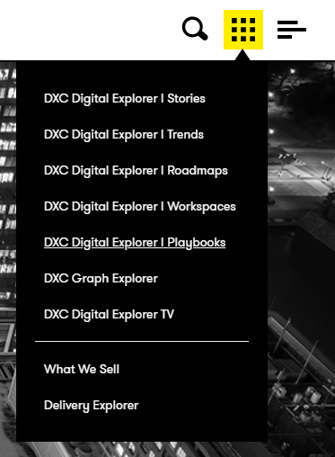

# DXC Digital Explorer Playbooks
## Viewing a playbook

1. Access the DXC Digital Explorer site
     - https://digitalexplorer.dxc.com/pb
      
1. If not already in the `Playbooks` module change to the Playbook module via the `appblock` in the header
     
1. Select **`Sign In`** from the header and login with your global pass account or DXC Digital Explorer account
     
1. Select the playbook you wish to view from the homepage

## :bulb: Navigation tip 
There are a number of ways you can turn the page within the Playbooks.

- You can use your left and right arrow keys to change pages.
- You can use your mouse to `pickup and turn the page`
- You can click on the right hand side of the page to turn to the next page
- You can click on the left hand side of the page to go back to the previous page

### :bulb: Content page tips 
The links within the content page can be selected and you will be taken directly to that section. 
This also applies to the solution contents section.

---

[[BACK - Playbook Overview]](PlaybookOverview.md) 
[[NEXT - Creating a playbook]](CreatingaPlaybook.md)
