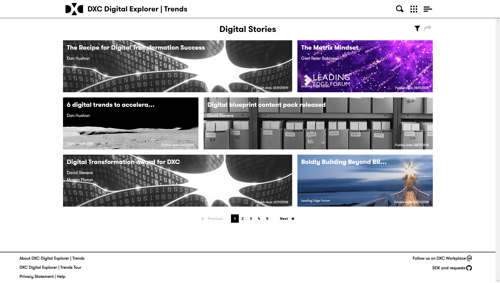
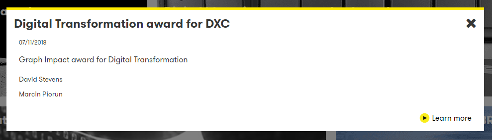

## DXC Digital Explorer | Stories

The stories module is there to provide easy access to selected content across the DXC Digital Explorer platform.

### Viewing a story
Accessing the stories page is via the `trends` module homepage, stories are presented in date order; with the latest story being shown first. 
 
 
Simply click on the story you wish to view and an information window will be shown providing some further information.
 
 
Most stories will forward you to a more detailed information, simply select the `Learn more` link in the lower right corner.
 

### Filters
In some cases a story may be assigned to an industry, technology group or have a focused tag applied to it.  Selecting the Filters icon on the homepage will allow you to select which filters you wish to apply. 
 
 

### Sharing a filtered view
You can also share a filtered view with other users, select the share icon to copy the filter view URL to your clipboard. 
 
 

----

### Creating a Digital Story

:lock: Trend reviewers permission is required to create stories

1. Select the `Collaboration Module` from the menu
1. Select `Digital Stories` 
 
1. The initial view allows you to edit or delete an existing story 
:bulb: you can also apply the filters to the list of stories 
:bulb: Editing a story presents the same form as a new story  
1. The story creation form consists of 8 sections 
 
    1. The Content 
    The content can either be an external URL or you can upload a file into the Digital Explorer platform. 
    2. Banner Image
    Every story needs a banner image to be used on the homepage, you can either select one from the provided library or upload your own image. 
    :bulb: Uploading images can be cropped to size to meet the requirements of the banner images. 
    3. Information 
    This is the key information for the story and is shown to the users when they select your banner image from the list of available stories. 
    4. Authors 
    Here you can select one or more authors to be associated with the story; note the creator of the story is not assigned as a author 
    5. DXC Restricted (optional)
    :warning: if the story (attachment or link) is restricted to DXC employees only then this checkbox should be selected
    6. Industry information (optional)
    7. Technology information (optional)
    8. Tags (optional)

## [Next - Industry Trends](../Trends104/readme.md)