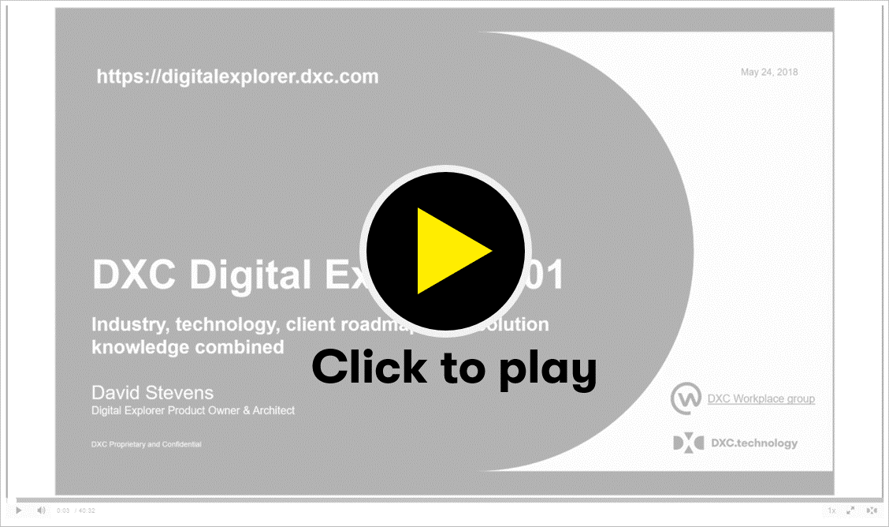

## Digital Explorer 101
### Introduction to the Digital Explorer Platform

#### :movie_camera: Overview of the Workspace module

- Understand how Digital Explorer can help you and your teams on your digital journey
- Platform overview
- Overview of the trends model
- Introduction to team workspaces

### Materials
- [Slides](DXCDigitalExplorer.101.pptx)
