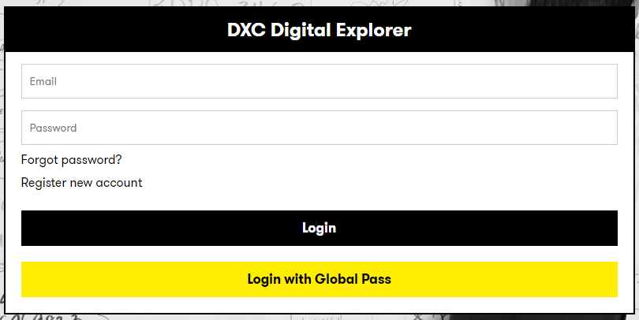
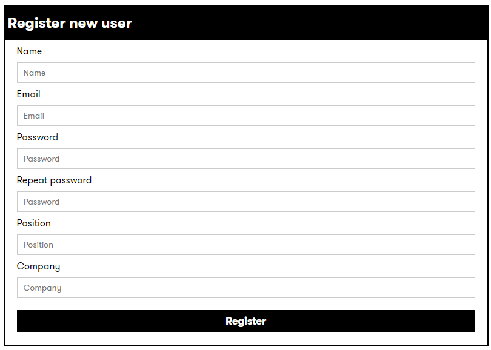

# Registering a trial account

Non-DXC employees can register for a 30 day limited account for the DXC Digital Explorer platform, please refer to 

- [DXC Digital Explorer Privacy Statement](../../PlatformPrivacyStatement.md)
- [User Features for non-DXC employees](../../userFeatures.md)

---

## How to Guide

- Access the DXC Digital Explorer platform [here](https://digitalexplorer.dxc.com)
- Select the `Register new account` option within the login dialog box 

- Enter the required information and select `Register` 

- You will receive an activation email to enable your account, follow the link within the email to confirm your registration

### Refer to the training guides for each module to learn about the features of the DE platform