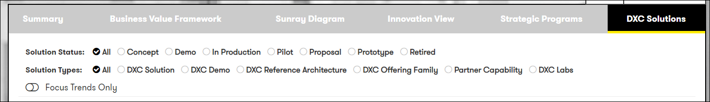

# Digital Explorer | Agendas - Creating your Agenda

## The Agenda output and creating Strategic Initiatives
Once you have completed your agenda within the canvas you are presented with the agenda output, from this view you can continue to work on some elements of the agenda, find potential candidate solutions and also define the Strategic Initiatives you will carry forward within the account.
 
The output is broken down into the following sections

- [Summary](Summary)
- [Business Value Framework](Business-Value-Framework)
- [Sunray Diagram](Sunray-Diagram)
- [Innovation View](Innovation-View)
- [Strategic Programs](Strategic-Programs)
- [DXC Solutions](DXC-Solutions)

### Summary view
Presenting to introduction information of the agenda, from this tab you can also select to `Edit` or `Export to PDF` and update the Status of the Agenda
 

#### Export to PDF
The PDF export include all sections of the innovation agenda, except **Strategic Programs** and **DXC Solutions**

### Business Value Framework
The Business Value Framework tab presents the uploaded BVF, if no BVF has been uploaded you can do so from this tab

### Sunray Diagram
You can control elements of the sunray diagram by using the controls on the right hand side. 
 
By default sizing is set to the `Innovation Level` defined for each trend  

:bulb:You can view the descriptions of the trends by moving you mouse over each one
 
The trends within the sunray diagram are colour coded based on their type and also if they have been identified as a **Focus Area**
 
- Business Trends are green
- Technology trends are blue
- Focus areas have a yellow edge

### Innovation View 
The innovation view is an interactive table for you to focus the content of the agenda to the current conversation 
 
You can control the horizonal and vertical dimensions using the options at the top of the page. 
 
 
You can also control which client value chains and the types of trends to be shown by using the controls on the right hand side 
  
:information_desk_person: You can edit any of the trend cards by double clicking on them.

### Strategic Programs
As you progress with the development of your innovation agenda you will ultimately create one or more Strategic Initiatives for the account team to carry forwards.  
:bulb: Only focus trends can be included within Strategic Initiatives 

 

The following information is required for each Strategic Initiatives

- Name
- Description
- SFDC ID (optional)
- Focus Areas

You can also select any of the goals or KPI's defined within the agenda within the Strategic Initiatives. 
:bulb: The goals, KPI's and focus trends captured here - go on to form the initial business view of the planned solution.

### DXC Solutions
The DXC Solutions tab presents a list of all available solutions within Digital Explorer with a relationship to one or more of the trends within the Innovation Agenda.   You can filter the list based on `Solution types` and `Status`

 

:bulb: To view a solution, click on the solution name