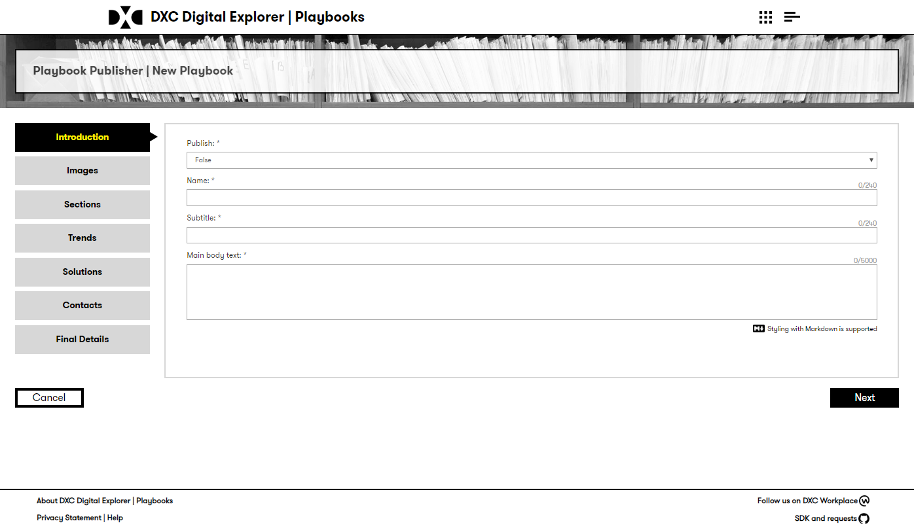
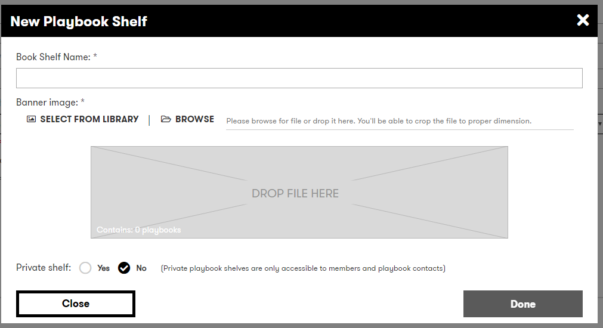
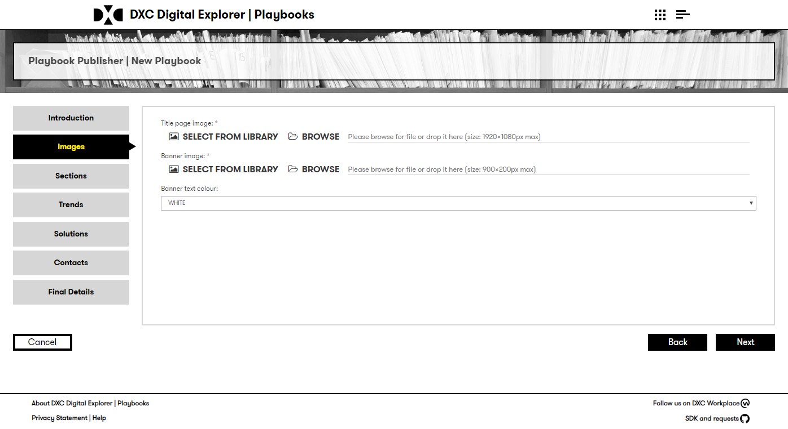
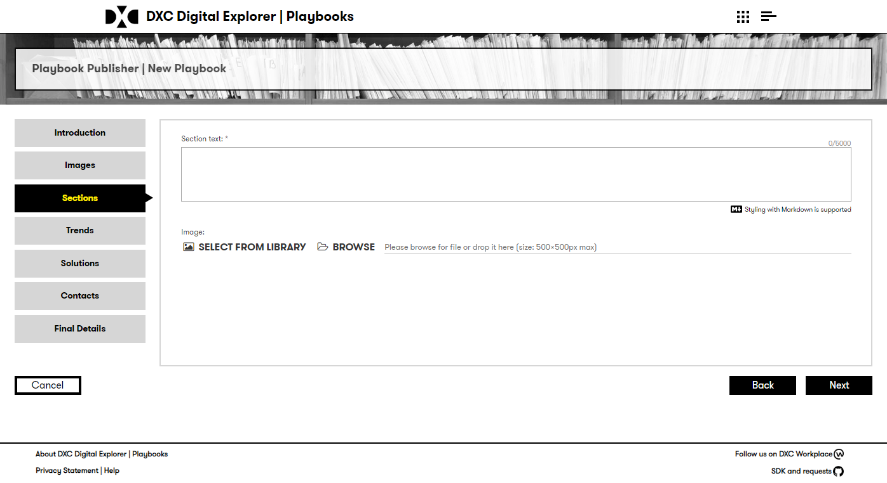
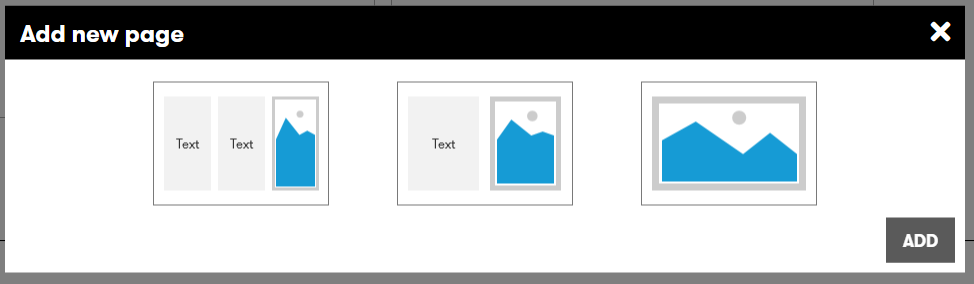
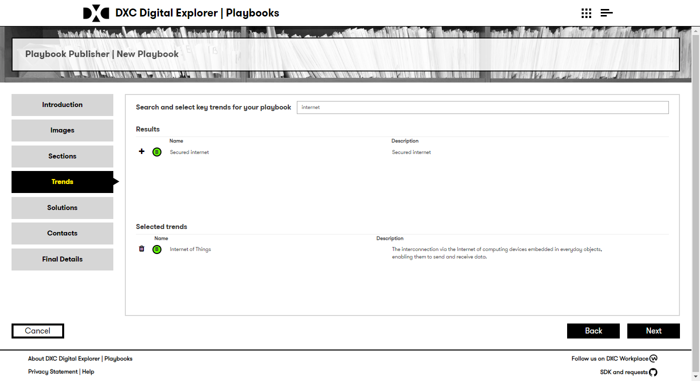
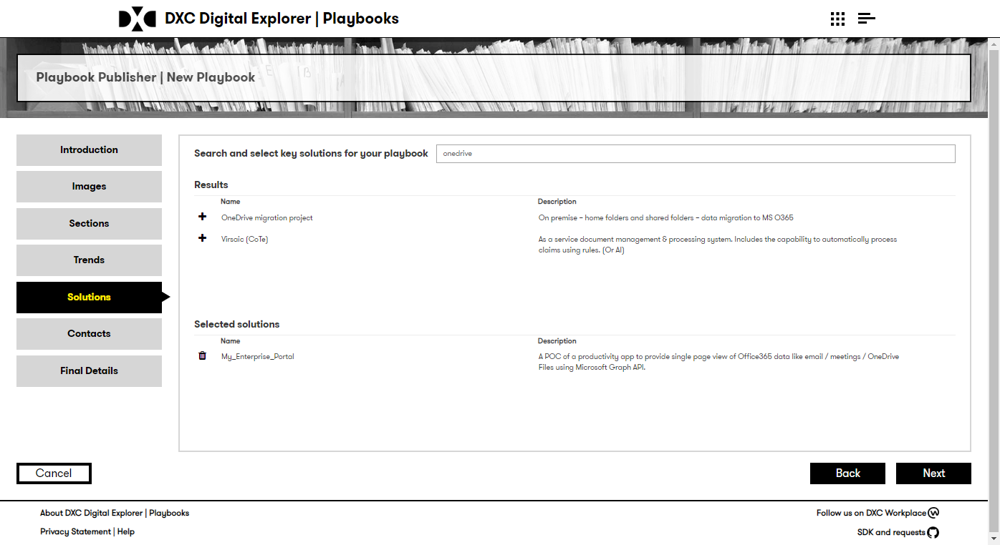
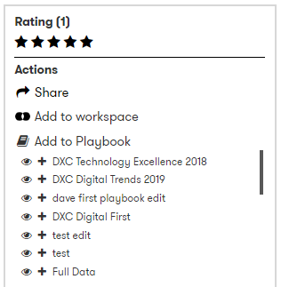

# DXC Digital Explorer Playbooks

##  Creating a playbook

### Preparing for your Playbook
Each Playbook is broken down into the following sections

- Introduction page
- Key trends
- Showcase solutions
- Contacts

Ensure you have this information in mind before you start

:bulb: the Introduction  and section pages support [markdown](https://jfcere.github.io/ngx-markdown/) formatting, allowing you to add to your presentation style

1. Access the DXC Digital Explorer site
     - https://digitalexplorer.dxc.com/pb
      
1. If not already in the `Playbooks` module change to the Playbook module via the `appblock` in the header
     
1. Select **`Sign In`** from the header and login with your global pass account or DXC Digital Explorer account
     
1. Select `Create new playbook` from the menu
     
1. The creation wizard steps you through each section of the playbook

### Introduction form
   
 
- Each playbook must belong to a `Playbook shelf`.  Select an existing shelf or create a new shelf for your playbook.
- The `Private` option allows you to restrict the access to your playbook, non-private playbooks are visible to all users on the main homepage
- The `DXC Only` allows you to restrict the playbook to only DXC Employees.

#### Shelf details
 
The playbook shelf is shown on the homepage of the playbooks module.  You can select the name, a banner image and also the text colour (black or white) for the banner text within the shelf details dialog.

### Images
   
  :bulb: You can select images for your playbook title page and banner from the provided library or upload your own. 
  :bulb: You can select the colour of your banner text to ensure it is visible on the homepage

### Pages text
  There are a number of page layouts available 
    
  :bulb: You can add more pages by selecting `Add new page`
     
  :bulb: On pages with images you can select a supporting image from the provided library or upload your own. 
  :bulb: You can change the order of the pages using the `arrows`
      
  :bulb: double click on any existing page to change it's layout 
      
   Available page layouts and notes  

|Layout|Description|
|---|---|
|GRAPH|Graph view from workspace**
|T_MAP|TMAP diagram from roadmaps**
|SUMMARY|Summary table from roadmaps**
|COMPARE|Compare view from workspace**
|RISK_TABLE|Risk table from roadmaps**
|TWO_COLUMNS_IMAGE_LEFT|1 text column image left
|TWO_COLUMNS_IMAGE_RIGHT|1 text column image left
|THREE_COLUMNS_IMAGE_LEFT|2 text columns image right
|THREE_COLUMNS_IMAGE_RIGHT|2 text columns image right
|THREE_COLUMNS|3 text columns
|TWO_COLUMNS|2 text columns
|ONE_COLUMN|single image view (full page)

### Trends
   
  search and add any required trends to your playbook.
  :bulb: you can remove any assigned trends by selecting the `trashcan` icon

### Solutions
   
  :bulb: you can remove any assigned solutions by selecting the `trashcan` icon

### Contacts
You can search and add any other DXC employee as a contact to your playbook. 
:warning: the person must have a user account within the Digital Explorer platform 
   
  :bulb: you can remove any assigned contacts by selecting the `trashcan` icon

### Final Details
:bulb: all information on this page is optional

    
:bulb: The more information link will be shown on the final page of the playbook

##  Adding a solution from the Solution Module
:bulb: You can add a solution directly from the solution datasheet within the Solution module to any existing playbook you have created

 

---

[[BACK - Viewing a playbook]](ViewingaPlaybook.md) 
[[NEXT - Managing your playbooks]](ManagingaPlaybook.md)