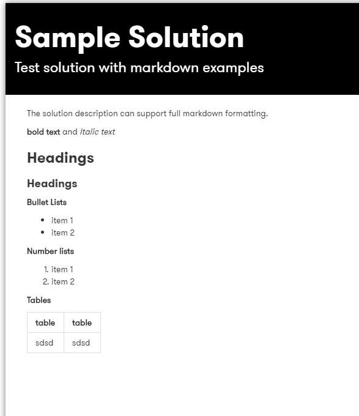

# DXC Digital Explorer - Playbooks Creator tips

## Links to other sites
:bulb: You can include links to external sites within the introduction section text.

Use the standard markdown formatting to create the link

 `[Text to be displayed](URL link)` 
 example 
 `[View the IOT coloring book guidelines on Github**](https://github.dxc.com/IoTColoringBook/UsageGuide)` 
which would then be shown as 
 

## Enriching your solution overview information

The solution overview shown within the playbook page is the Solution Description text from the Solution model and datasheet.

:bulb: Any markdown included within the solution description is applied to the solution overview description within the playbook

Examples of formatting to include within your solution description

**bold text** `**bold text**`

_Italic text_ `_Italic text_`

**Bullet Lists**
- item 1
- item 2
- item 3

~~~
- item 1
- item 2
- item 3
~~~

**Number lists**
1. item 1
1. item 2
1. item 3
~~~
1. item 1
1. item 2
1. item 3
~~~

### Headings `### Headings`

Tables
|heading|heading|
|---|---|
|table cell|table cell|
|table cell|table cell|

~~~
|heading|heading|
|---|---|
|table cell|table cell|
|table cell|table cell|
~~~

:bulb: recommendation is to use only H3 and H4 within your solution descriptions
