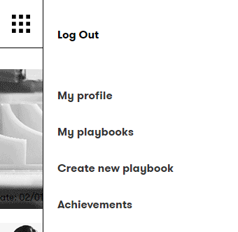
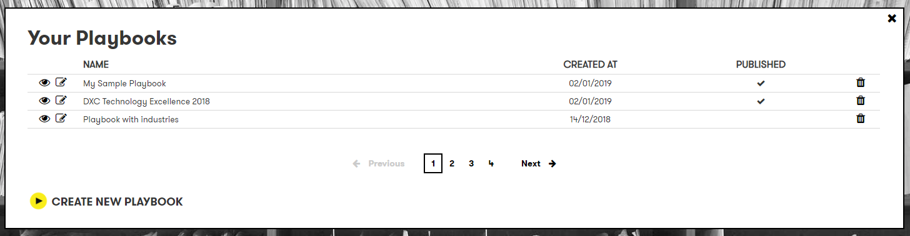

# DXC Digital Explorer Playbooks

##  Managing your playbooks

1. Access the DXC Digital Explorer site
     - https://digitalexplorer.dxc.com/pb
      
1. If not already in the `Playbooks` module change to the Playbook module via the `appblock` in the header
     
1. Select **`Sign In`** from the header and login with your global pass account or DXC Digital Explorer account
     
1. Select `My  playbook` from the menu
     
1. Your Playbooks
  
From this screen you can select to 
    1. View
    1. Edit
    1. Delete
 
You can also view the creation date and if your playbook is private or available to all users
