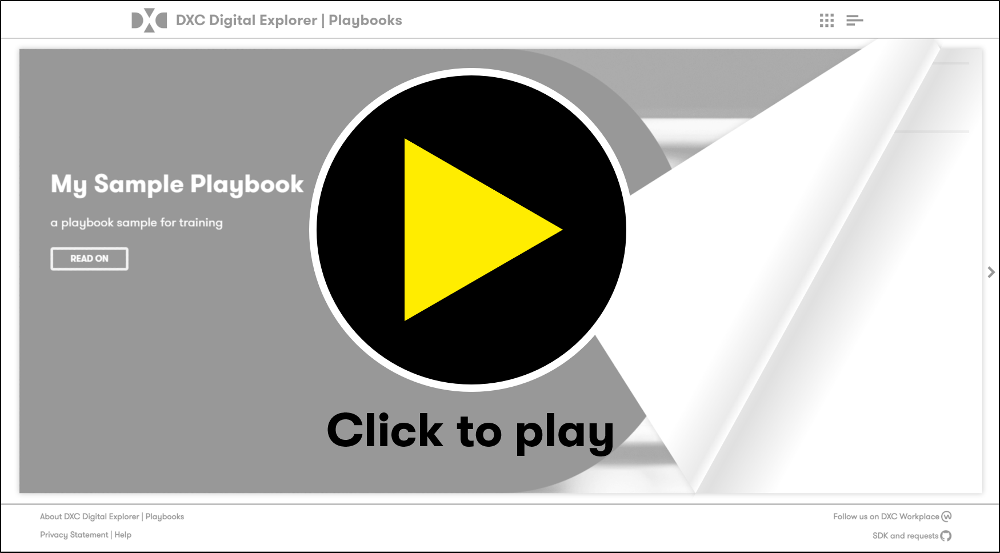

# DXC Digital Explorer Playbooks

The Playbooks module within DXC Digital Explorer allows you to create and share interactive content using the knowledge within the DXC Digital Explorer platform.

:bulb: You can create private playbooks, shown only on your playbooks homepage or accessible via a dedicated link you can share.

### Overview Video

### Example Use Cases

- Industry overviews
- Campaign results
- Technology Showcases
- Delivery Center and Customer briefing packs.

### Playbook sections
Each Playbook is broken down into the following sections

- Introduction page
- Key trends
- Showcase solutions
- Contacts

:bulb: the Introduction page support [markdown](https://jfcere.github.io/ngx-markdown/) formatting, allowing you to add to your presentation style 
:bulb: The Trends and Solution sections are both optional

## :trophy: Playbook Achievements
The following achievements are available for users of the playbook module

- Writer : Created your first playbook
- Author : Created your 5th playbook
 
You can view details of the awarded achievements via the achievement option from the menu.
 

---

[[NEXT - Viewing a playbook]](ViewingaPlaybook.md)
