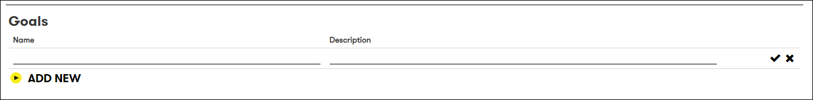
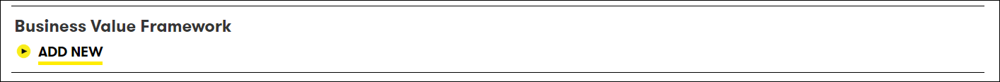

# Digital Explorer | Roadmap - Creating your Roadmap

## Initial Set-up 

1. Access the DigitalExplorer site
     - https://digitalexplorer.dxc.com/bvr
      
 1. If not already in the `Roadmap` module change to the solutions module via the `appblock` in the header
     
1. Select **`Sign In`** from the header and login with your global pass account
     
1. Select to `Create new Roadmap` 
     
1. Select to `Create new` 
      
    `From Template` is described in the following training module [Roadmap Templates](agendaTemplates.md) 
1. The new Roadmap form is broken down into 5 sections
    - General Information
    - Goals
    - Business Value Framework
    - Client Value Chains
    - Stakeholders 
1. General Information 
    **All these values are required**
      
    - Name - the shortname you want to give this Roadmap 
    - Description - a description of the Roadmap 
    - Status - current status of the Roadmap (`draft`, `in review`, `published`, `obsolete`) 
    - Account name - drop down list of available accounts 
    by default all users have access to the open `Training Account`, plus any other accounts to which you are assigned 
    - Industry 
    If a real account is selected the industry values are pre-populated, for training accounts you can select which industry you want to create your training Roadmap against 
    - Valid Until date : date when the Roadmap is no longer active 
    - Template : Yes or No  
    Will this template be a reusable template?  or dedicated for an account?

1. Goals
    **Optional**
      
    You can add any number of goals which are relevant to this Roadmap 
    You can pull these in from the `accounts business value framework` 
    :bulb: Goals can be associated to the client strategic initiative which you create within your Roadmap 

1. Business Value Framework 
     **Optional**
      
    You can add the account business value framework as an image as a reference within your roadmap 
    :information_desk_person: Save your account BVF slide as an PNG or JPEG image file to upload it 
1. Client Value Chains 
    If your account is related to an industry and sub industry with business trends defined within Digital Explorer Trends, your `client value chains` will be pre-populated for you.    These pre-populated client value chains will also pre-select any filters within the roadmap canvas to help with the selection of relevant trends. 
    :bulb: You are edit or delete the existing client value chains 
      
    You can add supporting information to each client value chain by selecting the edit icon  
    - Name
    - Description
    - Business Area 
    :bulb: The selected business area relates to which industry trends are included in your starting trend dock within the canvas.
    - KPI 
    :bulb: KPI's can be associated to the client strategic initiative which you create within your roadmap 
    - Value Chain Stakeholders
      

1. Stakeholders 
    **Optional** 
    You can add any client stakeholders as a point of reference within your roadmap, note these people do not gain access to the innovation roadmap.
     

:information_desk_person:  Your roadmap is now ready to be created, either select `Save & Close` or `next` to proceed to the `roadmap canvas` 

## [Next - The Roadmap Canvas](RoadmapCanvas.md)