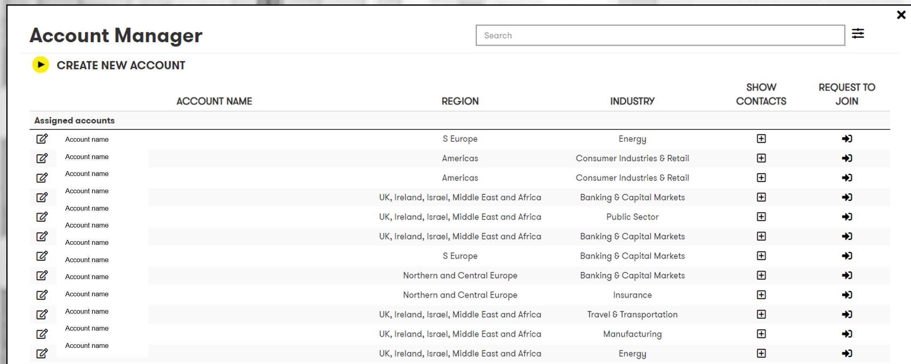
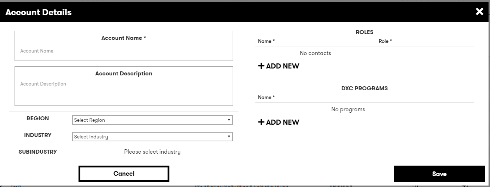

# Digital Explorer | Roadmaps - Create or join an account

In order to create a new digital roadmap you must be a member of the account team associated to the client 

## Create or join an account

1. Access the DigitalExplorer site
     - https://digitalexplorer.dxc.com/bvr
      
1. Select **`Login`**  with your global pass account 
     
 1. If not already in the `Roadmap` module change to the solutions module via the `appblock` in the header
     
1. Select **`Account  Manager`** from the context menu
          
 
:bulb:  Use the filters to narrow down the results to your required `Region` or `Industry`
 
You can expand the view of a single account to view the current account contacts

          
        
:bulb: Use the `Request to join` icon to ask the existing contacts to approve your request to join the account

###  Creating a new account

1. You can create a new account using the `Create account` option
          
        Provide the following information
        1. Name
        2. Description
        3. Region
        4. Industry
        5. Sub Industry
        6. At least one contact with a role assigned
        7. for details on `DXC Programs` see the following guide [here](RoadmapGroups.md)  
   
:bulb: As you enter the account name the application will suggest potential matches for you
