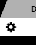
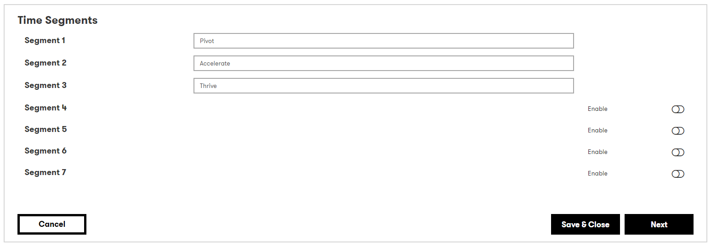
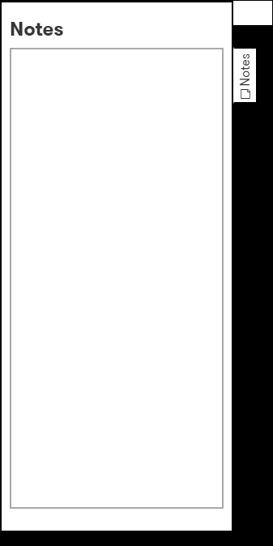
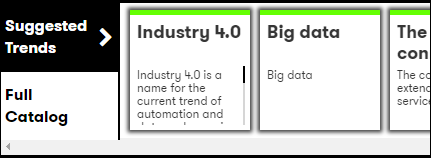

# Digital Explorer | Roadmaps - Creating your Digital Blueprint

## The Roadmaps Canvas
The main editing area of the Digital Blueprint is called the **Roadmaps Canvas**
 

#### Client Value Chains
The canvas presents each client value chain on it's own dedicated tab, you can switch between client chains by changing by selecting a different tab.  you can also add a new client value chain by selecting the [+] 

#### The Canvas Layout
The canvas is split into the configured time segments 
:bulb: You can configure the time segments by selecting the `Setting` icon within tabs section  
 
 

It is within these time segments where you place the relevant trends 
:bulb: You can add notes to each client value chain directly within the canvas, click on `notes` on the left hand side to expand your  
 

#### The Trend Dock
The trend dock presents the available trends to be selected and placed into the roadmap.
 
Here you can search, filter and switch between industry and technology trends. 
**Simply drag and drop the required trend into place**  
:bulb: As you start to define your roadmap, switching to `Suggested Trends` will show your recommended trends based on the trends within your roadmap. 
 

#### Editing Trends
You can edit and provide further information to any trend within the roadmap, simply double click on any of the `trend cards` on the canvas to open the detailed information dialog.  
 
- Name : you can edit the name of the trend to give it more meaning for the client
- Description : you can edit the description to give it a more focus meaning for the client and it's placement at this point within the roadmap
- Client Value Chain :information_desk_person: You can copy and move a trend between client value chains
- Innovation Level : defines the innovation level this trend will have 
- Business Areas : defined the business area this trend will impact within the clients environment
- Focus Area : is this trend a focus area for DXC and the client and potentially included within a `client idea`?

 
Once you have completed the canvas, select `save and view` to view the roadmap output 
 
:bulb: The Roadmap canvas will automatically save every 15 minutes  
:high_brightness: Aim for a maximum of 12 trends within each client value chain, any more and you may wish to split the value chain or roadmap into multiple parts. 

## [Next - The Roadmap Output](RoadmapOutput.md)