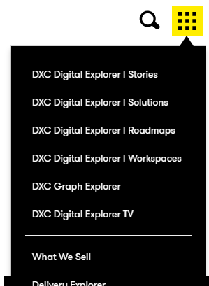
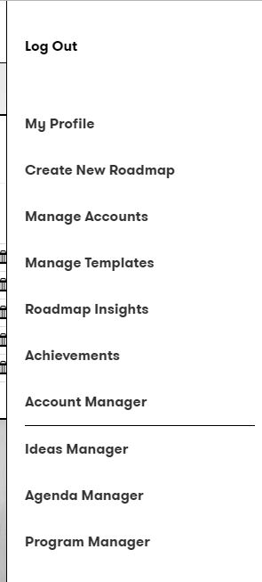
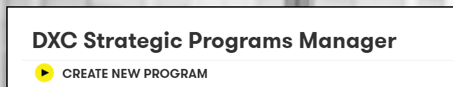
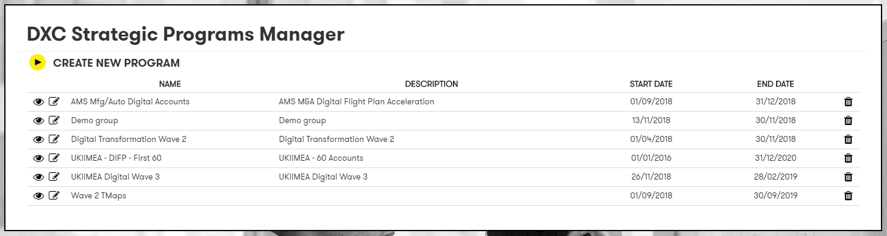
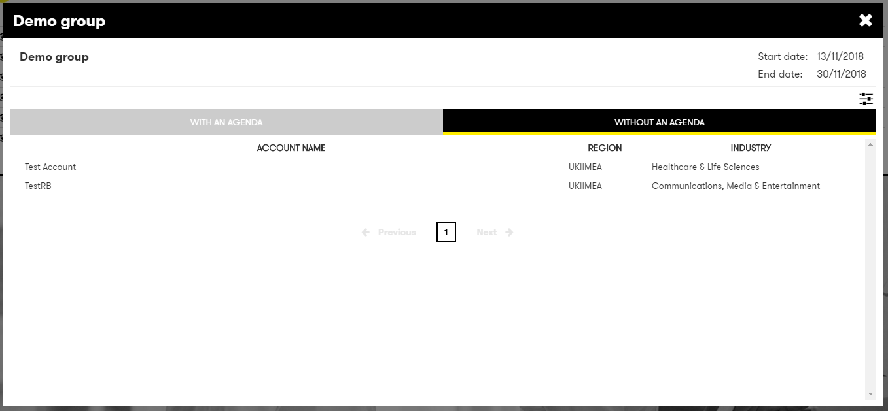

# Digital Explorer | Roadmaps - Program Groups

DXC Digital Explorer allows `Accounts` to be assigned to `internal program groups` within the roadmap module, this allows program leads the ability to track and report on a subset of accounts within the platform.

## Setting up a new group

1. Access the DigitalExplorer site
     - https://digitalexplorer.dxc.com/bvr
      
1. Select **`Login`**  with your global pass account 
     
 1. If not already in the `Roadmap` module change to the solutions module via the `appblock` in the header
     
1. Select **`Program Manager`** from the context menu
     
1. Select **`CREATE NEW PROGRAM`** 
     
1. Enter the required information
     
1. You can add accounts via this form, select `ADD NEW` 
1. You can also add account via the `account manager`

## Viewing a group

1. Access the DigitalExplorer site
     - https://digitalexplorer.dxc.com/bvr
      
1. Select **`Login`**  with your global pass account 
     
 1. If not already in the `Roadmap` module change to the solutions module via the `appblock` in the header
     
1. Select **`Program Manager`** from the context menu
     
1. Select the `EYE` icon to view an existing group
     
1. Select the `EYE` icon to view an existing group
     
1. Within this view you can view accounts with and without roadmaps
1. You can select to view any created roadmap by selecting the `eye` icon

