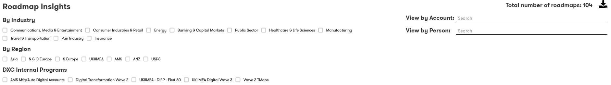

# Digital Explorer | Roadmaps - Insights

1. Access the DigitalExplorer site
     - https://digitalexplorer.dxc.com/bvr
      
 1. If not already in the `Roadmap` module change to the solutions module via the `appblock` in the header
     
1. Select **`Sign In`** from the header and login with your global pass account
     
1. Select **`Roadmap Insights`** from the homepage
     
1. The **`INSIGHTS`** report is split into 3 sections
    - Trends : heatmap of all trends included within within roadmaps
    - Signals : heatmap of signals included within roadmaps
    - Ideas : heatmap of trends referenced within the output `ideas` from the roadmaps

## The heatmap
 
The heatmap shows a simple count of each trend or signal included within the roadmaps
 

:bulb: You can use the `Slider` to change the range of trend counts to be included within the heatmap 
 
:bulb: You can click on any trend within the heatmap, to view the detailed trend overview pages.

## The filters
 
The filters allow you to filter down the results based on `INDUSTRY`, `REGION`, `INTERNAL PROGRAMS`, `ACCOUNT` and `PERSON` 
:bulb: The filters can be combined, for example `INDUSTRY` & `REGION`

## The Ideas tab
 
The ideas tab includes 2 bar charts which detail the number of ideas per `REGION` and `INDUSTRY` 
:bulb: Members of the roadmap managers role can select to view details of the ideas via the `VIEW IDEAS` link 
 
