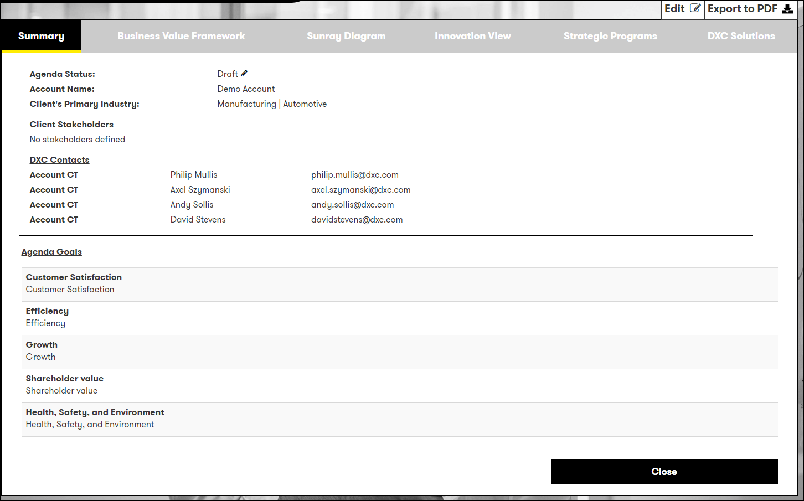
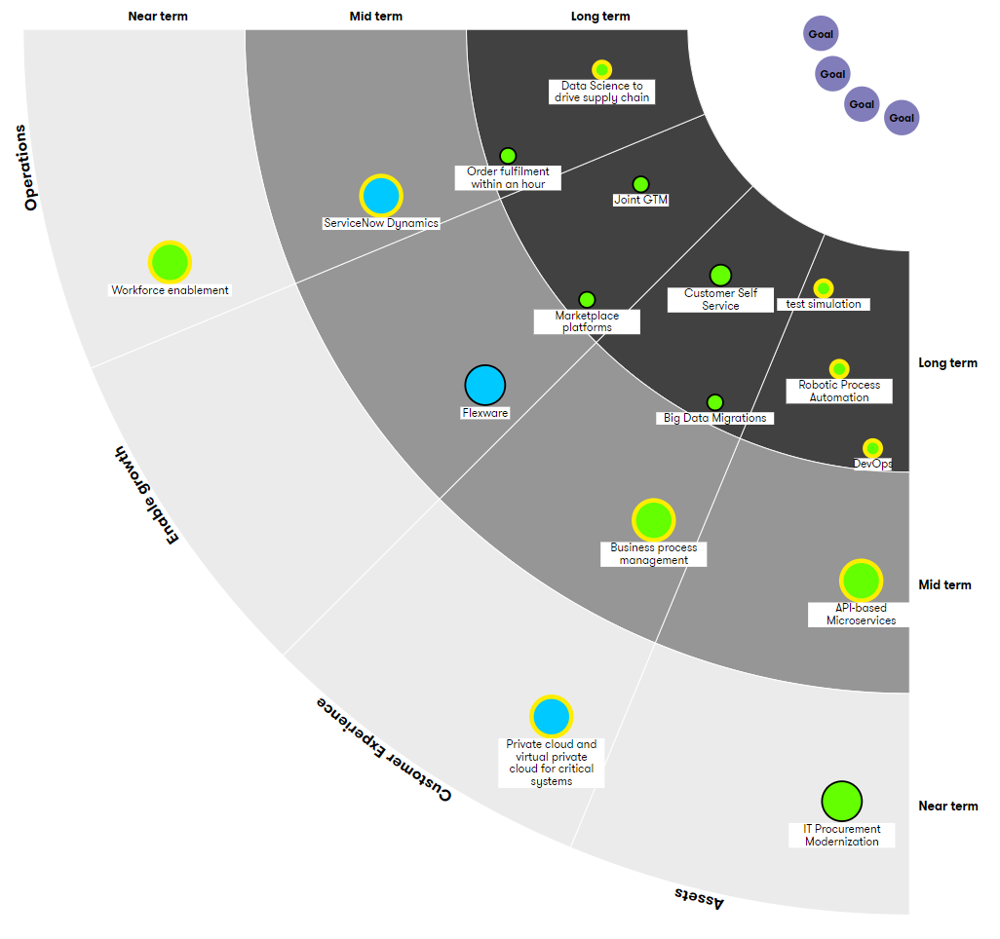
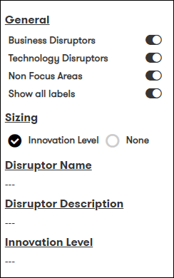
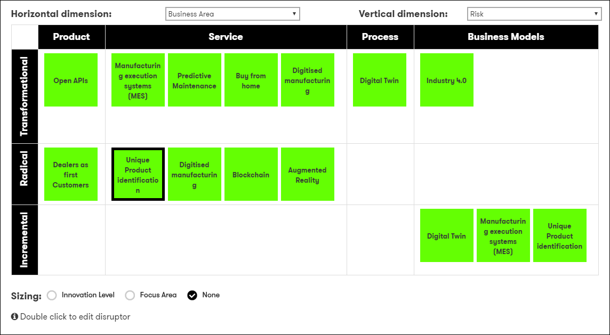
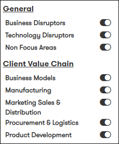
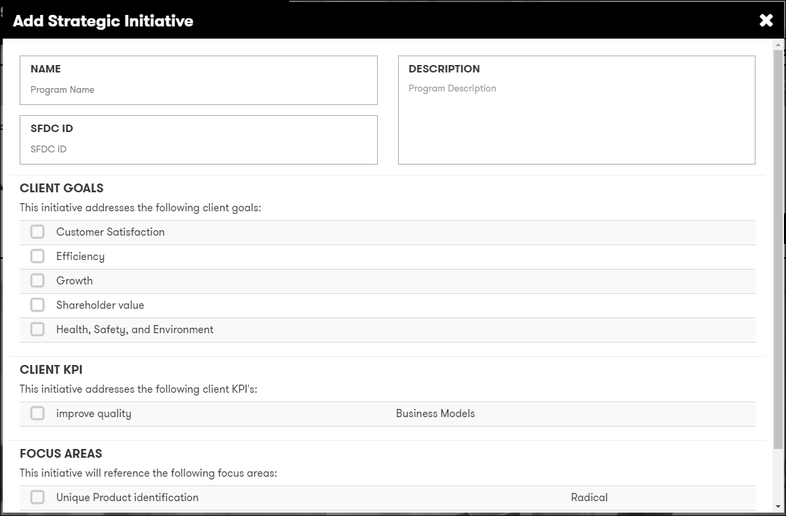
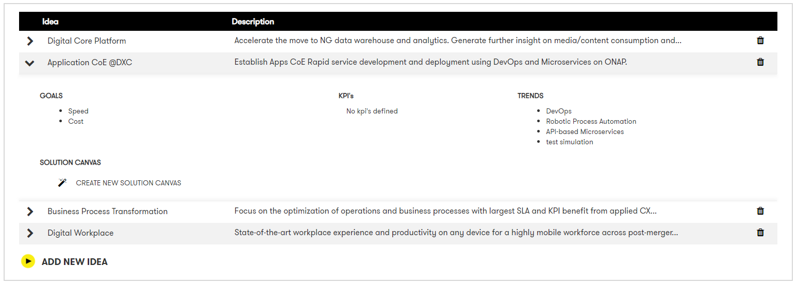
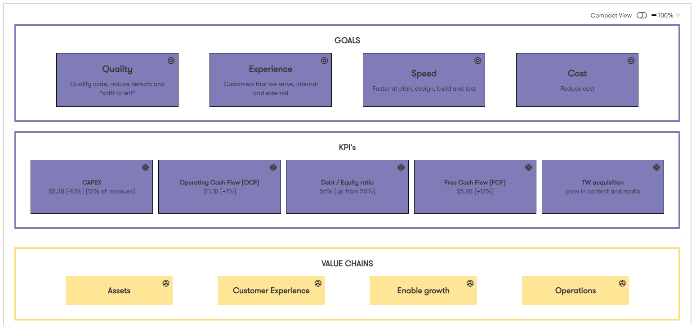

# Digital Explorer | roadmaps - Creating your roadmap

## The roadmap output and capturing Ideas
Once you have completed your roadmap within the canvas you are presented with the roadmap output, from this view you can continue to work on some elements of the roadmap, find potential candidate solutions and also define the Ideas you will carry forward within the account.
 
The output is broken down into the following sections

- [Summary](#Summary)
- [Sunray Diagram or TMAP](#Sunray-or-TMAP-Diagram)
- [Risk Ambition Profile](#Risk-Ambition-Profile)
- [Ideas](#Ideas)
- [DXC Solutions](#DXC-Solutions)

### Summary view
Presenting to introduction information of the roadmap, from this tab you can also select to `Edit` or `Export to PDF` and update the Status of the roadmap
 

#### Export to PDF
The PDF export include all sections of the innovation roadmap, except **Ideas** and **DXC Solutions**

### Sunray or TMAP Diagram
 
You can control elements of the diagram by using the controls on the right hand side. 
 
By default sizing is set to the `Innovation Level` defined for each trend  

:bulb:You can view the descriptions of the trends by moving you mouse over each one
 
The trends within the sunray diagram are colour coded based on their type and also if they have been identified as a **Focus Area**
 
- Business Trends are green
- Technology trends are blue
- Focus areas have a yellow edge

### Risk Ambition Profile
The Risk Ambition Profile view is an interactive table for you to focus the content of the roadmap to the current conversation 
 
You can control the horizontal and vertical dimensions using the options at the top of the page. 
 
 
You can also control which client value chains and the types of trends to be shown by using the controls on the right hand side 
  
:information_desk_person: You can edit any of the trend cards by double clicking on them.

### Ideas
As you progress with the development of your digital blueprint you will ultimately capture one or more Ideas for the account team to carry forwards.  
:bulb: Only focus trends can be included within Ideas 

 

The following information is required for each Idea

- Name
- Description
- SFDC ID (optional)
- Client Goals (optional)
- Client KPI's (optional)
- Focus Areas

:bulb: The goals, KPI's and focus trends captured here - go on to form the initial business view of the planned solution.

#### Progressing your ideas into Solutions
Once _Ideas_ have been captured, these can be viewed within the ideas section and also used to trigger the creation of a solution canvas within _DXC Digital Explorer Solutions_
 
:bulb: [See the detailed guide on creating a solution from an Idea](Idea2Solution.md)

### Summary
The summary view is essentially your Account Business Value Framework 
 

:bulb: You can switch between a full and compact view within the summary view 
:bulb: If ideas have been crated, you can select and get a focused view on the included Goals, KPI's and Trends 

### DXC Catalog Solutions
The DXC Solutions tab presents a list of all available solutions within Digital Explorer with a relationship to one or more of the trends within the roadmap.   You can filter the list based on `Solution types` and `Status`

 

:bulb: To view a solution, click on the solution name 
:bulb: You can add any solution into a DXC Digital Explorer Workspace