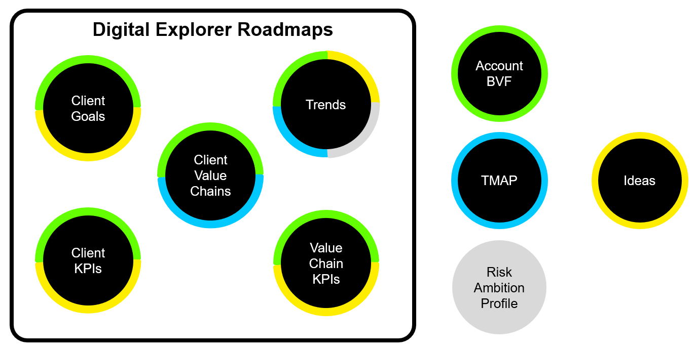

# Digital Explorer | Roadmap - Overview

The DXC Digital Explorer Roadmap module allows you and your account team to create the DXC Digital Blueprint.# 

## DXC Digital Blueprint
The DXC Digital Blueprint consists of the following information areas

- Client's Stakeholder
- Client's strategic goal's
- Client's strategic KPI's
- Client's Value Chains
- Any KPI's specific to each Value Chain
- Any Stakeholder's specific to each Value Chain

From the this initial information the DXC Digital Explorer Roadmap module allows you to select and position key technology trends which can help the client's reach their goals.

As you build out your client Digital Blueprint you can create a number of views, from the single dataset, to support their digital story.

### Available Data views

- **Account Business Value Framework**
- **Digital Transformation Map (TMAP)**
- **Risk Ambition Profile**

[_View examples_](#Example-data-views)

## Outline of the process steps

1. Setup your initial blueprint
    1. Goals
    1. KPIs
    1. Stakeholders
    1. Value Chains
1. Find and match trends (catalog and recommendations)
1. Discuss trends and relationship to goals with client
1. Discuss and capture innovation and risk levels associated to any trends
1. Capture candidate ideas

---

[[BACK - Roadmap training homepage]](readme.md) 
[[NEXT - Initial Set-up]](InitialSetup.md)

---

## Example data views

### Account Business Value Framework

### Digital Transformation Map (TMAP)

### Risk Ambition Profile

