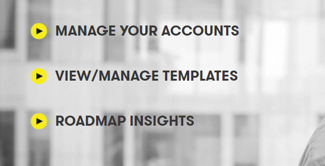

# Digital Explorer | Roadmaps - Using an Roadmap Template

You have the option to use an existing roadmap template to quickstart the creation of your account's roadmap. 
A template can include the following information

- Industry selections
- Goals
- Client Value Chains
- Client KPI's
- Business Value Framework
 
When working with a template you have to the option to remove any of the initial content and only use what you require.

## Selecting a template

1. Access the DigitalExplorer site
     - https://digitalexplorer.dxc.com/bvr
      
 1. If not already in the `roadmaps` module change to the solutions module via the `appblock` in the header
     
1. Select **`Sign In`** from the header and login with your global pass account
     
1. Select to `Create new innovation roadmap` 
     
Select to `From Template` 
      
1. A list of available templates is shown
      
1. Before you select your template you can view the contents by clicking on the **eye** icon
      
1. To use the template, simply selects the name, the information is preloaded into your account roadmap.
1. You will only need to add the initial information such as name and description, the other starting values are pulled in from the template.

## [Next - The Roadmap Canvas](AgendaCanvas.md)

