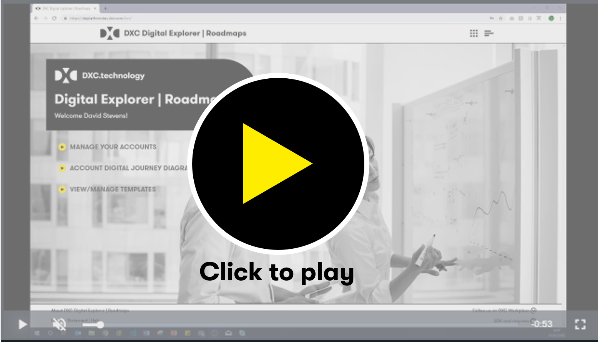

# Digital Explorer : Roadmaps 
## Before you begin

- Are you assigned to an account? 
:bulb:  **You must be assigned to an account in order to view or create a Roadmap** 
If you are not assigned to an account you can request access using the `Account Manager` page 

#### :movie_camera: Roadmap Module Training Playlist

_duration : 0:35_

### Supporting Training Guides

|Description|Level|Contact|
|---|---|---|
| [Overview of the Roadmap Module](RoadmapOverview.md) |100|David Stevens|
| [Initial roadmap Set-up](InitialSetup.md) |300|David Stevens|
| [The roadmap Canvas](RoadmapCanvas.md) |300|David Stevens|
| [The roadmap output and capturing Ideas](RoadmapOutput.md) |300|David Stevens|
| [Creating a solution from an Idea](Idea2Solution.md) |300|David Stevens|
| [Using a template](UsingaTemplate.md) |200|David Stevens|
| [Insights and reporting](RoadmapInsights.md)|300|David Stevens|
| [Program groups - how to manage and track a group of accounts](RoadmapGroups.md)|300|David Stevens|
| [FAQ](RoadmapFAQ.md)|100| David Stevens|

---

- [Definition of terms](../defintionsOfTerms.md)