# Digital Explorer | Solutions - Submitting your solution

### Preparing for your solution

- Breakdown your solution into it's parts
    - Business motivations and trends
    - The enabling features
        - DXC offerings
        - Partner capabilities
        - Client capabilities
        - Methods

- Prepare any supporting media you may want to include
    - videos
    - images
    - links

- Think about the team
    - architects
    - developers
    - testers

---

### Submission walkthrough

1. Access the DigitalExplorer site
     - https://digitalexplorer.dxc.com/se
      
1. If not already in the `Solutions` module change to the solutions module via the `appblock` in the header
     
1. Select **`Sign In`** from the header and login with your global pass account
     
1. Select **`Add Solution`** from the menu
     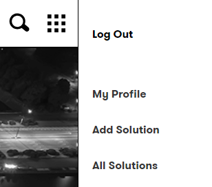
     
1. **The Solution form**
    - The first page gives an overview of how to approach the solution submission.  The key here is to consider the piece parts within your solution.
     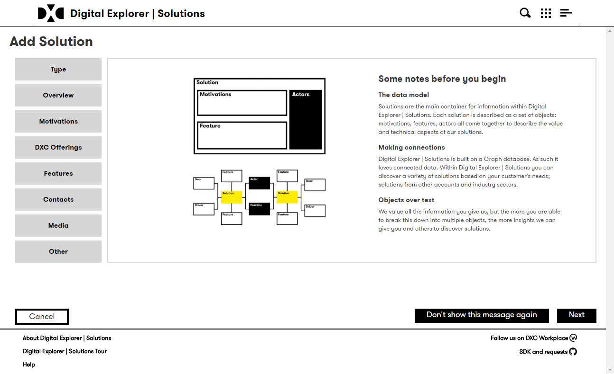
    - Select **`Next`** to enter the solution form
1. Select the type of solution you are adding
     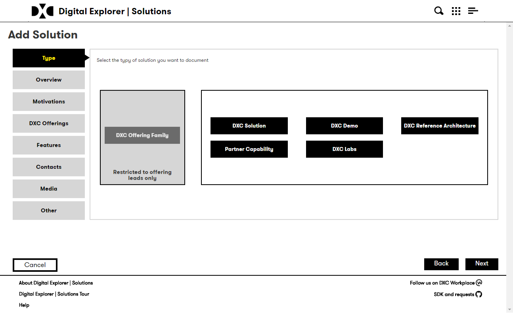
    - You can give further information on the status of the type on the next page of the form, for example `Prototype` or `Concept`
1. Initial information
     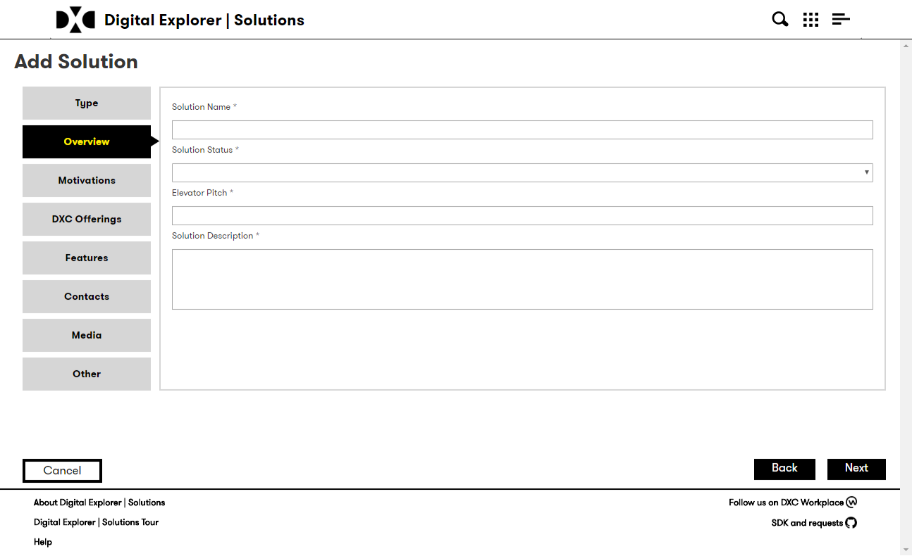
    - Solution Name : short name of the solution
    - Solution Status : current status of the solution
        - Concept
        - Prototype
        - Pilot
        - Production
        - Retired
    - Elevator Pitch : Short and powerful statement describing the solution.  **Limited to 140 characters**
    - Solution Description : Full description of the solution 
1. Business value and motivations
     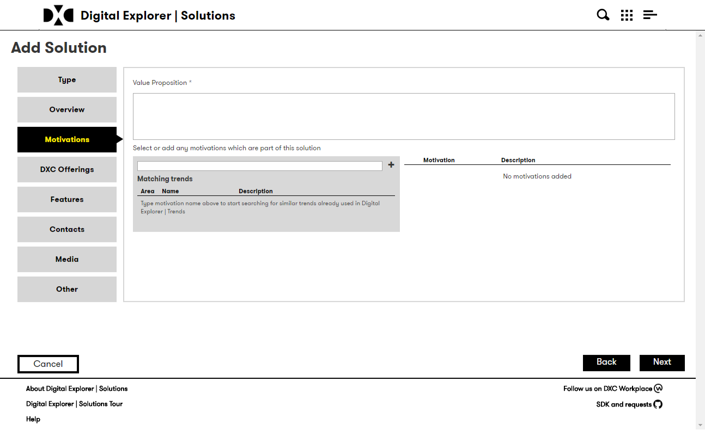
    - Value Proposition : full description of the business value of the solution 
1. **Motivations**
    - Motivations are a key part of the solution model, here you have the option to either select a matching business or technology trend from the Digital Explorer platform, or add your own.    Selecting existing trends, creates a link between your solution and the trend, ensuring your solution is discovered in client conversations.
    - As you type your motivations the form will start to match any trends within the knowledge base, select the **`+`** symbol to move these into your solution form
     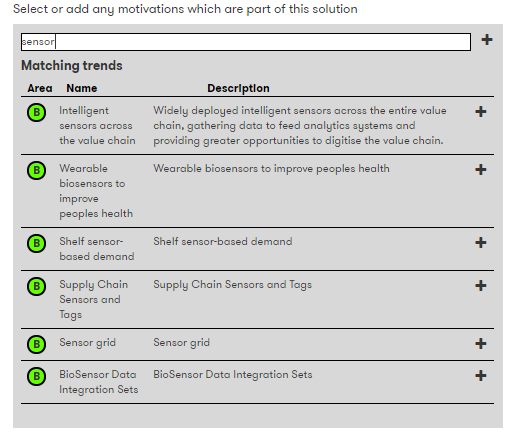
    - If you wish to add your motivation motivations, simply select the `+` next to the text field  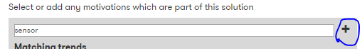
    - select **`Next`** to move to the next part of the form  
**The next 2 sections of the form add in the features which together form the enabling building blocks of the solution, first we add any DXC offerings** 
1. **DXC offerings**
     
    - The DXC offerings are grouped based on their Offering Family and Major Offering groups, expand each section as required and select the **`+`** to add the required offering into your solution
     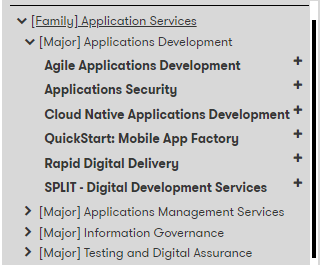
    - If you know the name of the offering, you can also search for it using the search field
     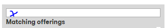
    
1. Other features 
    Once you have added the DXC offerings, you can add any other features to the solution.  A feature can be any of the following types
     
    - `Method`
    - `Capability`
    - `Component`
    - `Partner`
    - `Dataset` 
    As you add your other features Digital Explorer will search for any existing references to your feature, if a match is found it is presented in the list of matching features.
     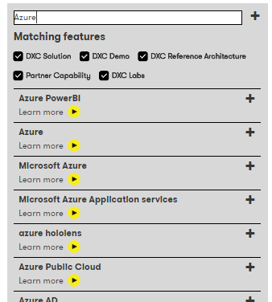 
    Use the **`+`** to add any matching features into your solution, you will inherit any supporting information also provided for the feature (i.e. Category, Description and Technology Group)
     
    You can add new features by selecting the `+`
     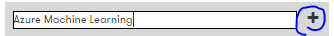 
    Once add, you have the option to provide the supporting information
         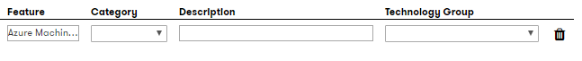 
    Once saved, this feature will become available for all other solutions to select.
 
**The solution model is now complete, the final 3 sections enrich and complete the overall solution definition.**

1. Contacts (team members)
     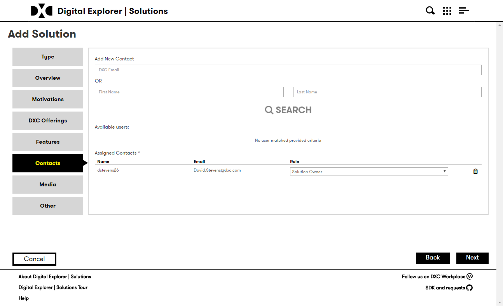
    - Add all members of the solution team
    - A person can be added multiple times and assigned different roles

1. Supporting media
     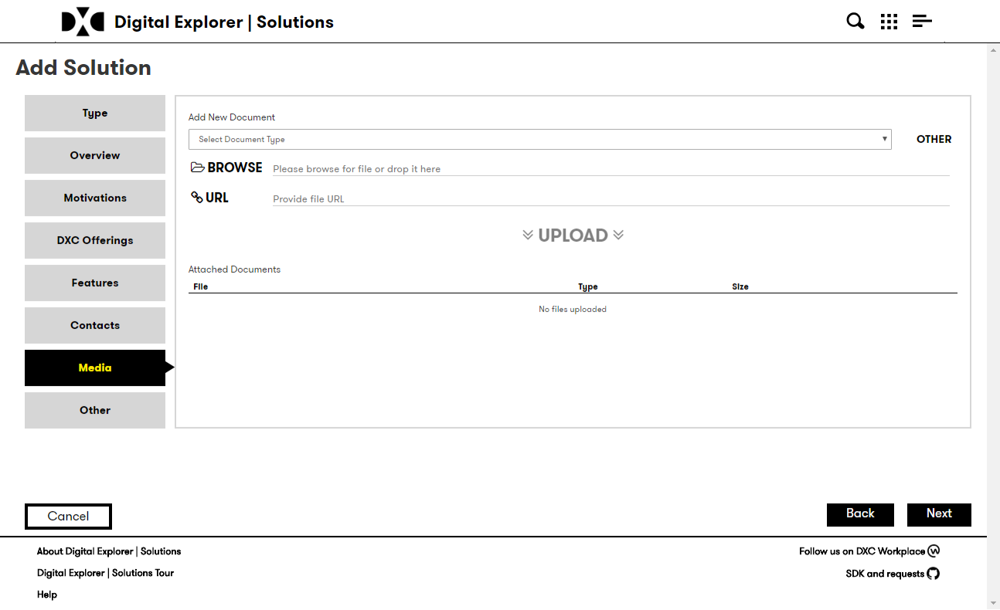
    - You can various types of media to support your solution description
        - Video
        - Images
        - documents
        - Links
     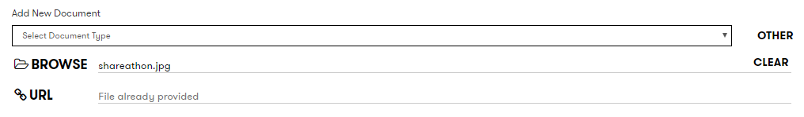
    - You have the option to either select from the pre-configured list of `documentation types` or select other and enter your own name
     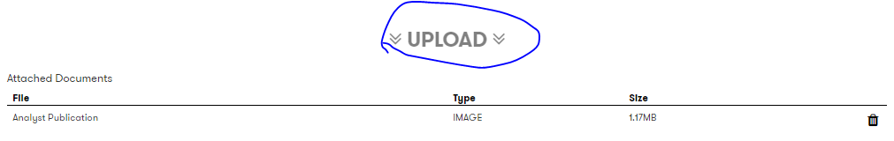
    - Ensure you select `UPLOAD` to include your media within your solution definition
  

1. Other information 
    The final page of the form closes out the required information
     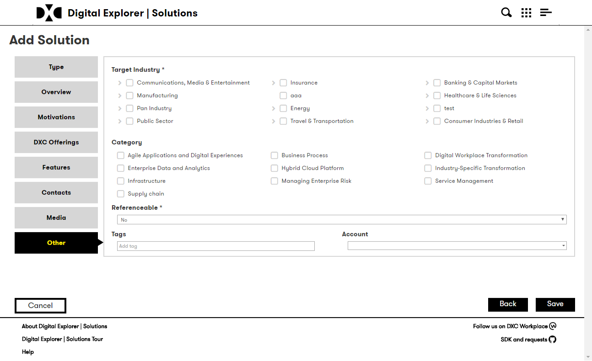
    - Industry : Select at least one industry for your solution
    - Category (Optional)
    - Referenceable : Yes or No **Default value is No**
    - Tags (Optional)
    - Account (Optional) : Select the accounts the solution has been delivered too.

1. :tada:Solution upload complete! 
The same form is presented if you wish to edit your solution.