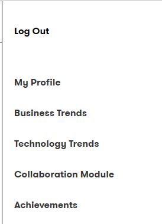
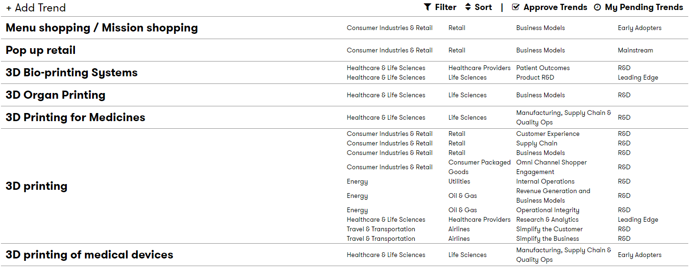
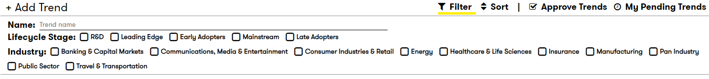
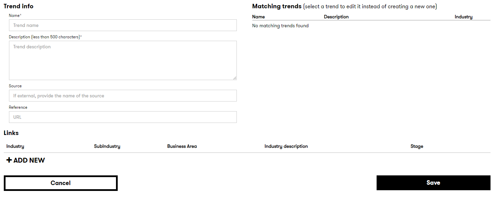
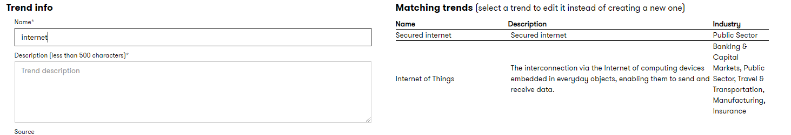
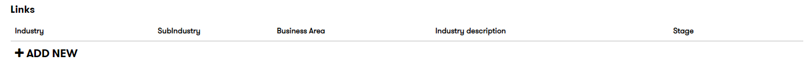
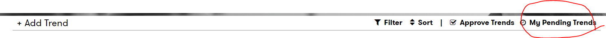

# DXC Digital Explorer | Trends - Submitting your trends

## Before you begin

- Think about the business area and the industry use case
- Are you adding a new trend and industry use case?
- Are you adding a new use case to an existing trend?    

The DXC Digital Explorer trends model is split into 2 section.

1. The general information about the trend
2. The detailed industry use case for the trend

A single trend can have multiple industry use cases

---

## Submission walkthrough

1. Access the DXC Digital Explorer site
     - https://digitalexplorer.dxc.com/se
      
1. If not already in the `Trends` module change to the trends module via the `appblock` in the header
     
1. Select **`Sign In`** from the header and login with your global pass account
     
1. Select **`Collaboration Module`** from the menu
     
     
1. Select 'Business Trends'
     
     
1. You are now presented with a list of all the trends within Digital Explorer, from here you can select an existing trend to add a new `industry use case` or add a completely new trend.
     
     
1. You can also filter the results based on name, industry and trend lifecycle stages
     
     
1. Adding or editing an existing trend presents you with the same form
     
     
1. If adding a new trend, are you type the name, you are presented with a list of potential existing trend to use.
      if you find a potential match, it is always better to add a new industry use case against an existing trend
     
     
1. The first part of the form is for the generic information of the trend. 
    :bookmark: Here keep the information as generic as possible, remember others may add their industry use case against this trend in the future
     
     
1. Once the generic description has been added, you can add the industry use case(s)
     
     
    You can add as many use cases as required.  A use case is associated with an individual business area within the industry.   
1. Once you have added the industry use case press "Save"
     
     
1. Your trend is now awaiting review, you can view your pending trends by selecting `My Pending trends` on the main collaboration page
     
     