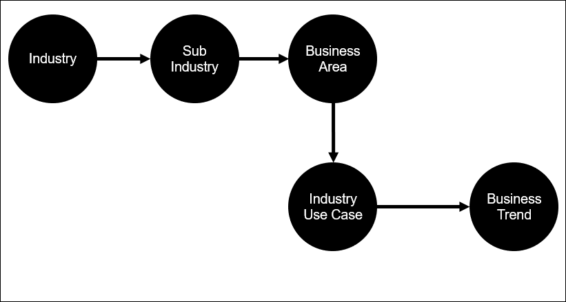
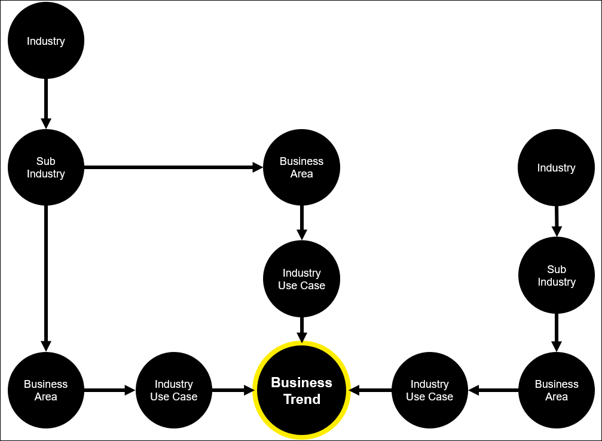

# DXC Digital Explorer | Trends 

## Overview of the Business Trends Model

Business trends are broken down into 2 main sections 

1. The **general** description of the trend
1. The **industry use case** for the trend as it relates to a business area within an industry
 

## A single trend can have multiple industry use cases for the same industry and across different industries.  This allows Digital Explorer to build detailed views of a single trend across multiple industries.

## Adoption Levels
Each industry use case is assigned an adoption level to give an indication of the current level of adoption within the business area.  
 :bulb: These values represent a general viewpoint only and do not account for potential regional differences

|Adoption Stage| Description | Adoption levels
|---|---|---|
|R&D|Trends currently in their early stages of implementation, mainly within R&D projects|NA
|Leading Edge|Indicated when a trend has moved out of R&D and into operations, still presents some risk and generally adopted by start-ups or forward looking enterprises|5%
|Early Adopters|Risks are lower and operational integrity is higher|25%
|Mainstream|at this point the trend can be considered mainstream as it has reached 50% adoption|50%
|Late Adopters|Wide spread adoption across the industry, stable and low risk| 80-100%

---

## [Next - The trends website](../Trends102/readme.md)

### :computer: [Technical description of the trend model](https://github.dxc.com/DigitalExplorer/Digital-Explorer-Specs/blob/master/MetaModels/BusinessTrendMetaModel.md)