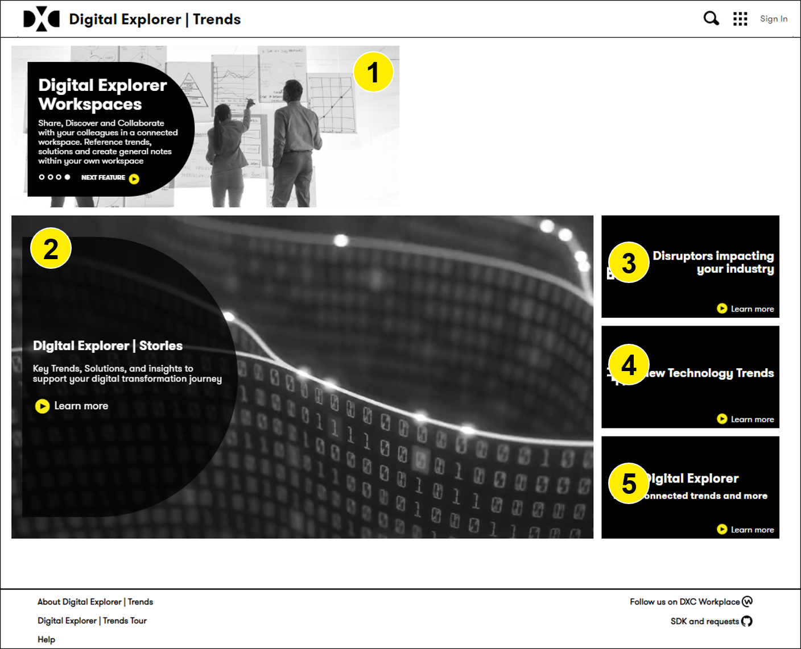

# Digital Explorer | Trends 

## Overview of the Trends website

The Trends homepage consists of 5 sections

1. Information Banner
1. Digital Stories
1. Industry Trends
1. Technology Trends
1. Trends Insights

### Information Banner
Rolling banner giving details of each of the modules within the Digital Explorer platform

### Digital Stories
Highlights and recommended reads from across the Digital Explorer platform

### Industry Trends
Review key industry trends

### Technology Trends
Review key technology trends

### Trends Insights
Review insights from across the Digital Explorer platform, including summary viewpoints of key trends and demand signals.

## [Next - Digital Stories](../Trends103/readme.md)
## [Next - Industry Trends](../Trends104/readme.md)
## [Next - Technology Trends](../Trends105/readme.md)
## [Next - Trends Insights](../Trends106/readme.md)