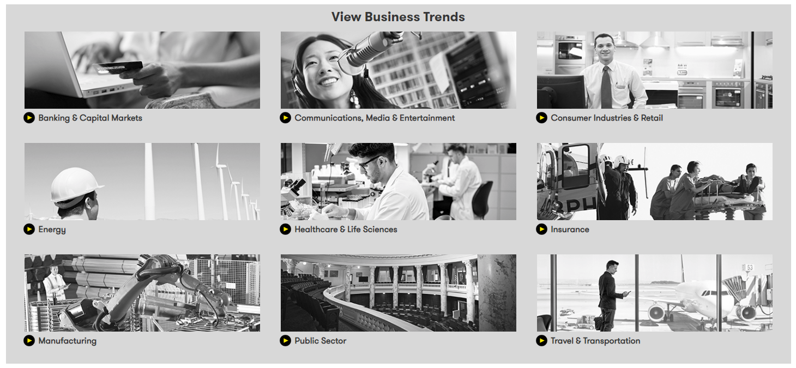
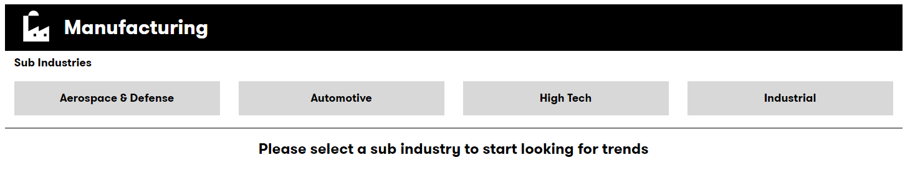
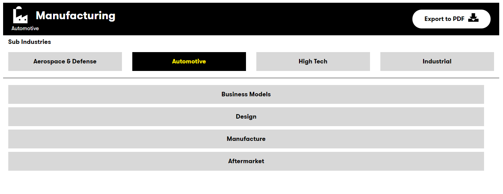

## DXC Digital Explorer : Industry Trends 

The industry trends page is the master reference points for Digital trends impacting any given industry.  The information is structured against the DXC industry model.
 
**Industry > Sub Industry > Business Area**

- To navigate the information, simply select a target industry on the main page; each industry page follows the same layout.  The page below is an example of an industry page from the _Manufacturing_ industry. 
 
- From this page, select the required **Sub Industry** 
- After selecting the required Sub Industry, the relevant **business areas** impacted by Digital Transformation are shown 
 
- Select the required business area; from here you can then select each **maturity stage** to view the trends within your chosen industry. 
 
- Trend information panel 
 
The trend information panel consists of 5 areas: 
    1. A general description of the trend 
    1. A use case description on how this trend is impacted your selected _business area_ within the _sub-industry_ 
    1. Source and Author information
    1. Option to `Learn more` about the selected trend; selecting this link will forward you to a complete summary of the trend across all industries; including demand curves, available solutions and experts. 
    1. Options to interact with other modules within the DXC Digital Explorer platform
       1. Search for Solutions
       1. Add this trend to an existing or new workspace
       1. Add this trend to an existing playbook

## [Next - Technology Trends](../Trends105/readme.md)