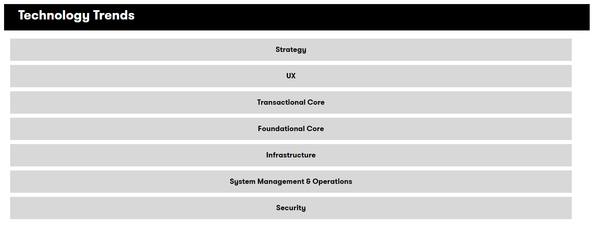

## DXC Digital Explorer : Technology Trends 

The technology trends page is the master reference points for Digital trends key technology areas.  The information is structured against the DXC architecture canvas model. 

- To navigate the information, simply select a target technology group on the main page; each technology group follows the same layout. 
 
- Select the required  **maturity stage** to view the trends within your chosen technology area. 
- Trend information panel 
 
The trend information panel consists of 4 areas: 
    1. A general description of the trend 
    1. Source and Author information
    1. Option to `Learn more` about the selected trend; selecting this link will forward you to a complete summary of the trend across all industries; including demand curves, available solutions and experts. 
    1. Options to interact with other modules within the DXC Digital Explorer platform
       1. Search for Solutions
       1. Add this trend to an existing or new workspace
       1. Add this trend to an existing playbook

## [Next - Trend Insights](../Trends106/readme.md)