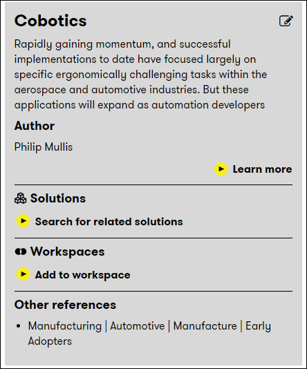

# Digital Explorer | Workspaces

## Adding a trend

You can add a trend to an existing workspace directly within the Trends module

1. When viewing a trend within the **Trends** module you can add any trends to a new or existing **Workspace**
      
1. Select "Add to Workspace" to view the list of existing workspace or select to create a new space
      

:bulb: If you select the `eye` icon next to your workspace name you will be forwarded to your workspace canvas

## [Next - Adding a Solution to a Workspace](AddingaSolutiontoaWorkspace.md)