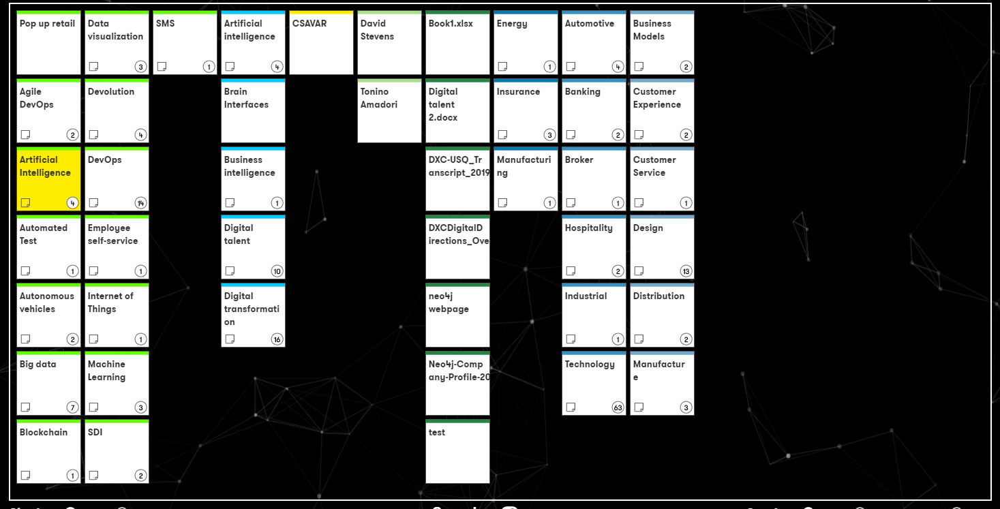

# DXC Digital Explorer - Workspace real-time collaboration

_Released Feb 2019_
 

DXC Digital Explorer workspaces allows members of a Workspace to work in real-time; whereby each member can clearly see which other members are online, receive all updates in real-time and also **present and highlight** cards within the workspace to show other online members key focus areas during the discussions

## Online Members
As each member of a workspace joins, the information bar informs other online members when the person joins 

 

You can view a list of all online members by expanding the `Online Members` tab on the right hand side 

 

## Presenting
Online members have the option to `Present` to other online members, simply select the `Present` option via the `Online Members` tab and any other online member will be able to see which card the `Leader` has highlighted

 