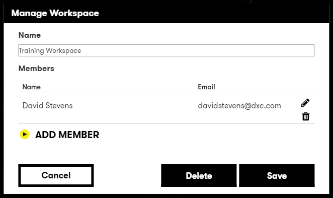
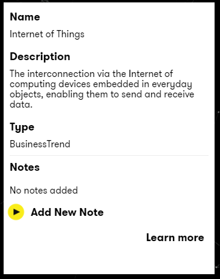
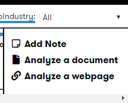
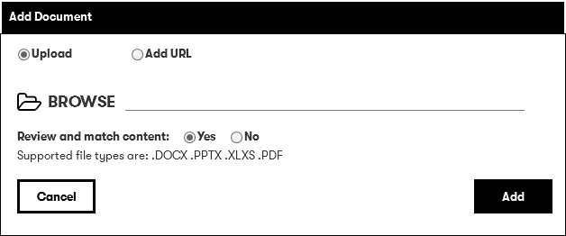

# Digital Explorer | Workspaces

## The Workspace Canvas

1. The Workspace canvas is divided into 4 areas: 
      
    1. Manage Workspace
    1. The Canvas
    1. Information Panel
    1. The Dock
1. **Manage Workspace**  
 Allows you to 
    1. Add and remove people as members of your workspace 
    :information_desk_person: When you add a person they will receive an email with details on how to access the workspace 
    1. Delete your workspace
       
1. **The Canvas** presents any cards you have added to your workspace 
    :bulb: You can change the grouping and order of the cards using the options below the canvas 
       
1. **The Information Panel** presents the information for a selected card. 
       
    :bulb: Here you can also add notes against any of the cards but selecting **Add New Note**  
     
    :information_desk_person: If the card is a trend from Digital Explorer you will also have the option to **Learn More**, selecting this option will direct you to the detailed page for the trend. 
1. **The Dock** presents the contents from all modules of Digital Explorer, Trends, Solutions and People 
     You can search for content using the search field 
      
     and filter the content types shown within the dock 
          
     you can also add external content and notes to your workspace 
           
    When adding new content you can either upload a file or provide a URL address
           
        **Jan 2019 feature** : Digital Explorer will now analyse the contents of your document and add any matching "cards" to your workspace. 
        See [Document Upload and Analyse](workspaceDocuments.md)

## [Next - Adding a Trend to a Workspace](AddingaTrendtoaWorkspace.md)