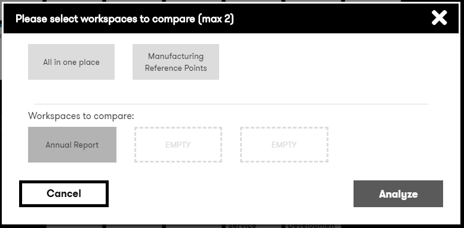

# Digital Explorer | Workspaces

## Workspace Compare
The `Compare` options allows users to select 2 or 3 workspaces and compare for similar results

- Access the Compare via the workspace tools 
   
- Select 1 or 2 other workspaces you wish to compare and click `Compare` 
   

The results are shown as a Venn Diagram

  
 
:bulb: you can click to zoom into a section to see the details 
:bulb: hoover over the `node` to view the details within the information panel 