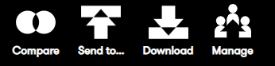
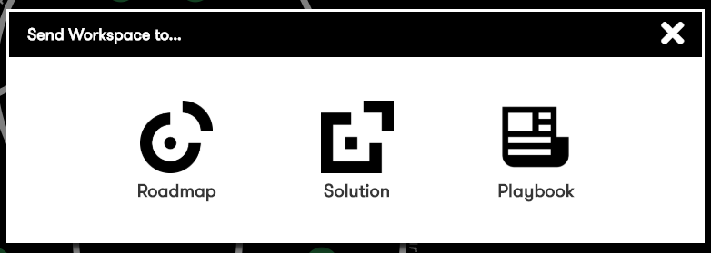
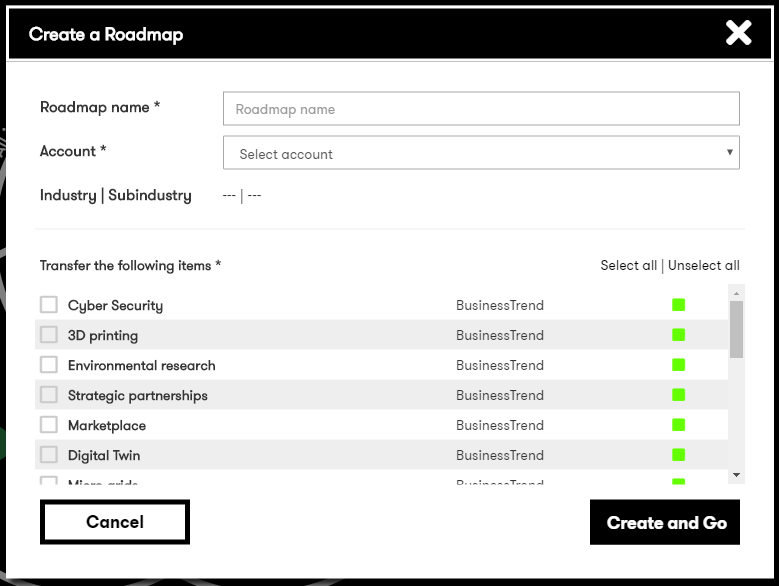
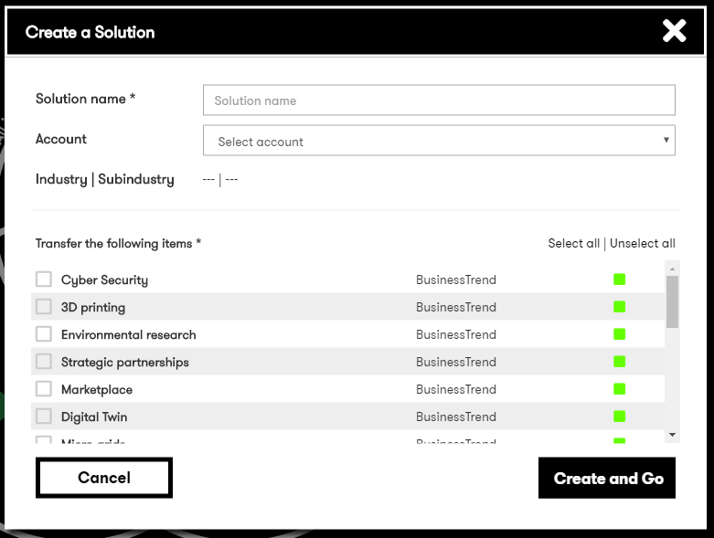

# Digital Explorer | Workspaces

## Send To

The send to option allows users to transfer any content within the workspace into another Digital Explorer module; the table below highlights which content can be transferred into another module. 

|Content|Roadmap|Solution|Playbook|
|---|---|---|---|
|Business Trends|x|x|x
|Technology Trends|x|x|x
|Solutions|x|||
|People|x|||

- Access the `SendTo` option  the workspace tools 
   
- Select the target module 
   

depending on the target module you are presented with various choices to make

### Send to Roadmap
To send information to a roadmap you need to provide the **name** of the roadmap and also select which **account** you wish to create the roadmap for.   You then select which trends you wish to include.
 
:bulb: you can `select all` 
   

### Send to Solution
To send information to a **Solution** you need to provide the **name** of the solution.  You can also select an account (optional).   You then select which trends you wish to include.
   
:bulb: you can `select all` 
 

  ### Send to Playbook
To send information to a **Playbook** you need to provide the **name** of the Playbook.   You then select which trends, solutions and people you wish to include
:bulb: you can `select all` 
   