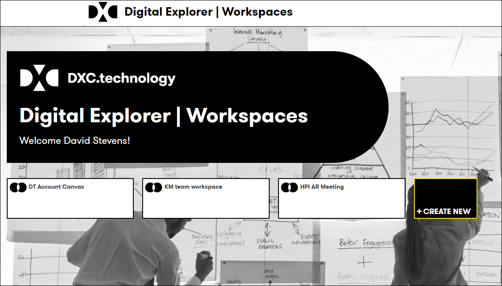

# Digital Explorer | Workspaces

## Setting up your workspace

1. Access the DigitalExplorer site
     - https://digitalexplorer.dxc.com/dew
      
1. If not already in the `Workspace` module change to the solutions module via the `appblock` in the header
     
1. Select **`Sign In`** from the header and login with your global pass account
     
1. Select the `CREATE NEW` 
      
    :information_desk_person: If you have existing workspaces these are also shown on the homepage

## [Next - The Workspace Canvas](WorkspaceCanvas.md)