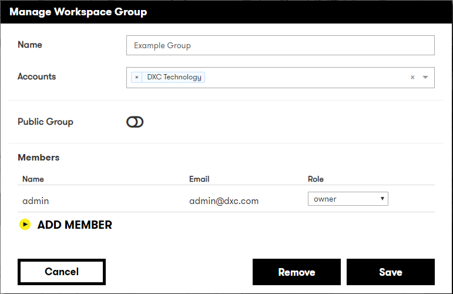

# Digital Explorer | Workspaces

## Managing your Workspace Group

Within your workspace group you have the following options

- Workgroup Name
- Associated Accounts
- Public Group : Yes/No
- Members and Roles

      

:bulb: you can only associate accounts to workgroup to which you have a role. 
:bulb: Other members of the workgroup do not need to be members of the account 
If a group is public, all users of DXC Digital Explorer can use the workspaces within the group as a source for the **Compare** feature
  
Only **members** can add or edit workspaces within a group

 

## [Next - The Workspace Canvas](WorkspaceCanvas.md)