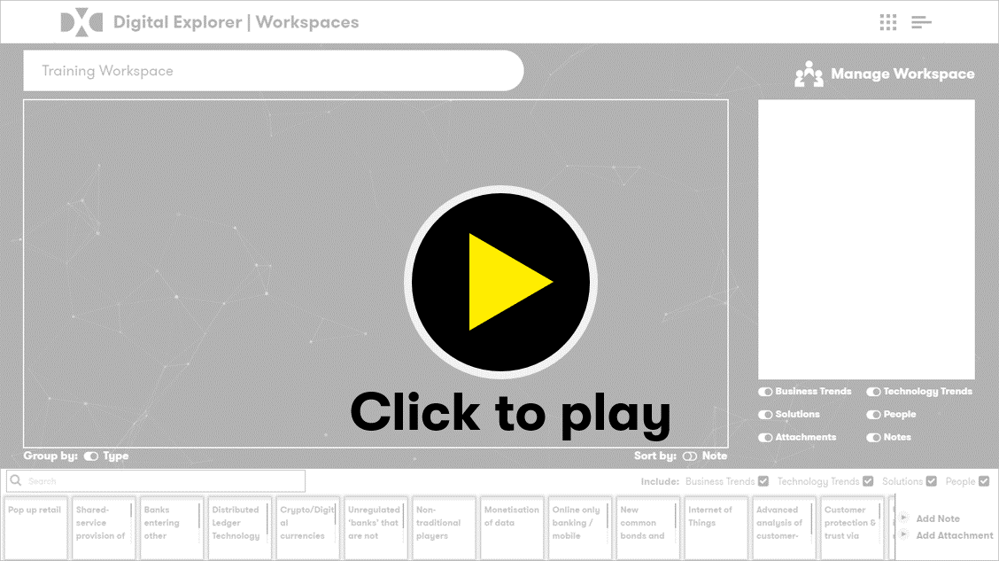

## Digital Explorer : Workspaces

#### :movie_camera: Workspace Video Training Playlist

_duration : 0:56_
---

### Supporting Training Guides

|Description|Level|Contact|
|---|---|---|
| [Creating a Workspace](WorkspaceSetup.md) |100|David Stevens|
| [Using the Workspace Canvas](WorkspaceCanvas.md)|100|David Stevens|
| [Adding a Trend to a Workspace](AddingaTrendtoaWorkspace.md) |200|David Stevens|
| [Adding a Solution to a Workspace](AddingaSolutiontoaWorkspace.md) |200|David Stevens|
| [Workspace document upload and analyse](workspaceDocuments.md)|200|David Stevens|
| [Real-time collaboration](Real-timeCollaboration.md)|200|David Stevens|

