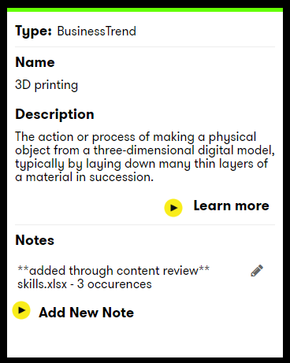

# DXC Digital Explorer - Workspace document upload and analyse

_Released Jan 2019_
 
DXC Digital Explorer workspaces will now analyse documents or website and load the matching content into your workspace.

## Content matches
The following content types are matched within the Digital Explorer Platform

`document contains`
- Business trend
- Technology trend
- Industry
- Sub Industry
- Business Area of any matched Industry or Sub Industry

## Supported file types

- PDF
- Microsoft Word (.docx)
- Microsoft Excel (.xlsx)
- Microsoft Powerpoint (.pptx)

:bulb: **WE DO NOT STORE YOUR FILE ON THE SYSTEM - THE CONTENTS IS ONLY READ**

## How to guide

1. Login and access your workspace see [Workspace set-up](WorkspaceSetup.md) and [Workspace Canvas](WorkspaceCanvas.md) guides for details
2. Select to `Analyze a document` or `Analyze a webpage` via the workspace toolbar 
 
1. Documents
   1. Browse or Drag and Drop your document into the file reader dialog 
     
   2. Select `Add`
1. Webpages
   1. Copy and paste the required URL into the dialog
   2. Enter a friendly name for your  reference 
     
   3. Select `Add`

- Digital Explorer will read, analyse and add any matching cards into your workspace
- A note is included within each matching card detailing the source file associated with the match and also the number of occurrences the match was found within the document. 
 

