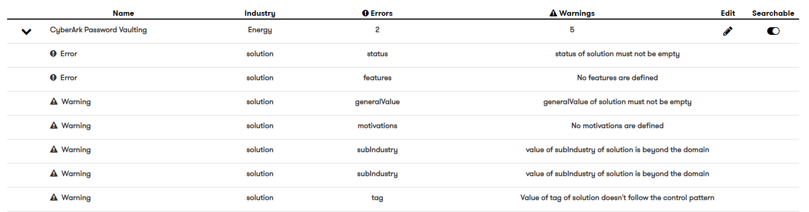

# DXC Digital Explorer - Platform Admin - User roles
 
:warning: Access to the admin pages is restricted to only users assigned the `Admin` role 
 
:warning: A general understanding of the Digital Explorer platform is assumed so step-by-step notes will not be provided for some standard actions (e.g accessing a named module and menu items)
 
:bulb: Access to all the platform admin items is via the `Solutions` module
 

## Data quality reports

- Select Data Validation from the admin page
- 3 data quality reports are available.
  1. Solutions
  2. Attachments
  3. What We Sell Sync 
  
 

### Solutions
The solution data quality reports allows you to select a target industry and validate the data quality of each solution.  The report provides insight into the number of `errors` and `warnings` for each solution 
  
 You can directly edit the solution and also remove it from any search results. 
 
 ### Attachments
 The attachment report will return the details of any attachment nodes which do not have a relationship to any other nodes.  you can simply select the required node and remove it from the database. 

 ### What We Sell Report
 The What We Sell report provides details of any retired sub-offerings and if they have existing client solutions associated to them.  In the case where no client solution have been associated to them the retired sub-offering can be deleted.   Similar to the metadata; retired sub-offerings are not listed for new solutions and only retained for historical information. 