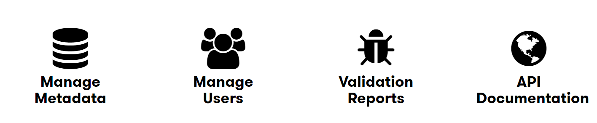

# DXC Digital Explorer - Platform Admin - Meta Data
 
:warning: Access to the admin pages is restricted to only users assigned the `Admin` role 
 
:warning: A general understanding of the Digital Explorer platform is assume so step-by-step notes will not be provided for some standard actions (e.g accessing a named module and menu items)
 
:bulb: Access to all the platform admin items is via the `Solutions` module
 

## Meta Data
:bulb: DXC Digital Explorer has a separation between Meta and Live data, whereby only once the meta data has been used once within the application is the live node created.   The meta data presents a list of all available category data within the platform; where as live will give representation of the selected and active content.

- Select  `Manage Metadata` from the admin page 
 
- Simply select which meta data area you wish to update 
 
- You can **Add**, **Edit** and **Delete** values
- In some cases the meta data may have secondary categories, here you can expand the parent category and add/edit or delete the child category

:bulb: When deleting a metadata node, you will not impact any live data which has referenced the meta data.   Deleting the meta node prevents future submissions from selecting the meta data values.
